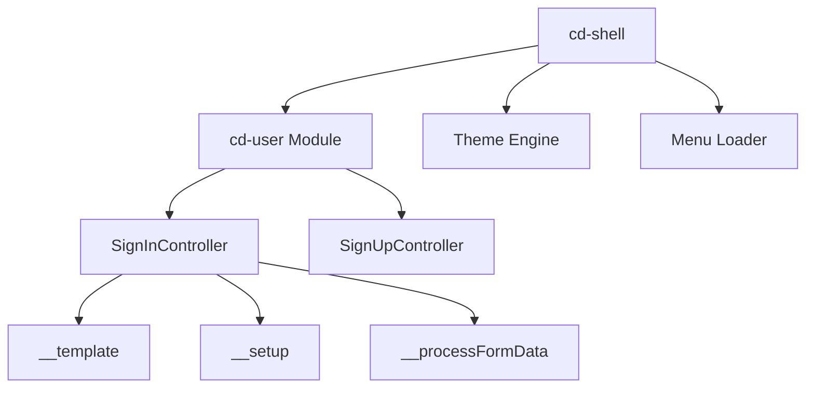
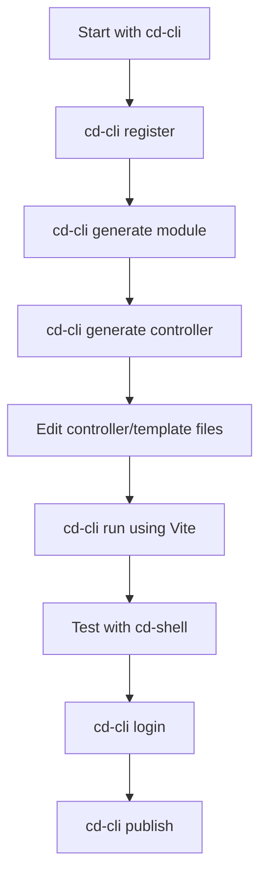

---

## cd-shell Developer Guide

### 1. Purpose & Mission

* **Mission**: `cd-shell` is a Progressive Web App (PWA) front-end shell that interacts with cd-api modules.
* It serves as a modular, themeable, plugin-capable UI base — so that future features, themes, and UI modules can be scaffolded by `cd-cli` and plugged into it.
* An important part of requrement is to have modules to be installable during cd-shell run time. This should be executable without any need for restart or any form of interruption.
* Initially run manually, but the long-term vision is that `cd-cli` can scaffold not just server modules, but also `cd-shell` UI modules, pages, and plugins.


---

The project is built around the concept of a **highly decoupled core**, allowing third-party features (Modules) and presentation (Themes) to be plugged in.

### 1. The Core Architecture: The Shell

**Project Concept:** The `cd-shell` is the "operating system" or container for the PWA. It handles everything that is *not* a feature or a visual style.

| Component | Likely Implementation Details | Purpose (Your Memory Cue) |
| :--- | :--- | :--- |
| **PWA Entry** | `index.html`, Service Worker (`sw.js`) | This file registers the core shell and ensures offline capability. This is the **base layer** that makes the app installable. |
| **Routing** | A router (e.g., React Router, Vue Router) | Manages navigation between the `cd-shell` views (e.g., the home screen, settings) and routes defined by **installed modules**. |
| **State Management** | Global store or Context/Redux | Holds global data, like the currently active **Theme ID**, the list of **installed Modules**, and the user's session state. |
| **Module Loader** | A core API/Utility file. | The function responsible for dynamically importing and initializing the code for installable modules. **(This is the heart of the shell.)** |

### 2. Key Mechanism: Installable Modules

You designed the actual features to be external, installable units. This suggests a **Plugin Architecture** or **Micro-Frontend** approach.

| Module Aspect | Your Implementation Focus | What to Check First |
| :--- | :--- | :--- |
| **Module Contract** | A standardized way that all modules must expose their code (e.g., exporting a `Module` class or a setup function). | Check the `/src/modules` or `/src/core/ModuleAPI` directory for the base abstract class or interface used by all feature modules. |
| **Module Manifest** | Each module likely has a small manifest file (`module.json` or within `package.json`). | This manifest is key! It contains the module's name, version, required permissions, and crucially, the **entry point URL/file** the shell needs to load it. |
| **Dynamic Loading** | The use of `import()` statements (Dynamic Imports) or a bundler feature (e.g., Webpack Federation). | This ensures modules are only downloaded and initialized when a user navigates to a feature, keeping the main shell bundle small. |

**The crucial working principle here is: The shell loads a module, and the module registers its routes, components, and data points with the shell's global API.**

### 3. Key Mechanism: Themes Configuration (GUI)

The GUI is separated via themes. This points to a rigorous separation of UI logic from business logic.

| Theme Aspect | Your Implementation Focus | What to Check First |
| :--- | :--- | :--- |
| **Theme Structure** | A theme is likely just a folder containing structured CSS/SCSS/LESS files and possibly a configuration JSON. | Look for a `/src/themes` directory. Each sub-folder is a theme (e.g., `default`, `corporate`, `dark`). |
| **Configuration** | A `theme.json` file inside the theme folder. | This file defines key variables: primary color, secondary color, font families, and perhaps which root components to swap out (e.g., a custom header component). |
| **CSS Variables** | The shell likely loads a root CSS file that uses CSS Variables (or 'Custom Properties'). | All components (both Shell and Module components) reference these variables (e.g., `var(--theme-primary-color)`), allowing the theme config file to change the entire look with a simple variable change. |

**The memory trigger:** The shell loads the UI framework, but the **Theme config dictates the variable values and possibly the component hierarchy for the standard UI elements** (like the main navigation bar or footer).

### 4. Documentation (Markdown Files)

You mentioned markdown files to shed light on **working principles**. These are your best friend for a quick refresher.

| File Location (Likely) | Expected Content |
| :--- | :--- |
| `README.md` (Root) | High-level summary, setup instructions (`npm install`, `npm start`), and build commands. |
| `docs/Principles.md` or `ARCHITECTURE.md` | **The key file!** This details the contract between the Shell, Modules, and Themes. It likely explains the Module API interface, lifecycle hooks, and theme variable conventions. |
| `docs/Theming.md` | Explains how to create a new theme: what files are required, and the list of supported CSS variables. |
| `docs/ModuleDev.md` | The tutorial for adding a new feature. Includes instructions on creating the module manifest and registering the module with the shell. |

---

## Runtime Architecture




---

### 2. Project Structure & Key Parts

From your tree:

```
src/
├ assets/        ← CSS, fonts, images
├ base/          ← core controllers / models / services shared by all UI
├ bootstrap/     ← startup, loader logic
├ config/        ← shell-wide config, theming
├ global.d.ts
├ index.ts       ← entry point
├ menu/          ← menu-specific code
├ module/         ← module UI parts (controllers, models, services)
├ modules/        ← plug-in modules or dynamic modules (app, sys)
├ plugins/        ← plugin architecture (app, data, ui, system, etc.)
├ theme/          ← theming support (theme loader, services)
├ utils/          ← helpers (logger, script loader, etc.)
└ vite.config.ts
```

Important ideas:

* `bootstrap/loader.ts` likely initializes plugins, themes, module registry.
* `modules/` folder holds modules loaded dynamically (probably fetched or packaged).
* `plugins/` is your extension system (UI, data, etc.)
* `base/` holds core abstractions that UI modules can extend.

---

### 3. How to Run / Demo

As you already saw from `package.json`, here’s the workflow:

1. **Install dependencies**

   ```bash
   npm install
   ```

2. **Start dev server**

   ```bash
   npm run dev
   ```

   This runs `predev` script (`./scripts/sync-config.sh`) then `vite`, serving the app (usually at `localhost:5173` or similar). The shell app should appear in your browser.

3. **Build production version**

   ```bash
   npm run build
   ```

   This runs `prebuild` (syncs configs) then `vite build` — output goes to `dist/`.

4. **Preview built version**

   ```bash
   npm run preview
   ```

   A local server renders the built version so you can test offline, PWA behavior, etc.

5. **Test on mobile/emulator**

   * With the dev server running, open its URL in your Android emulator or mobile browser.
   * If you have wrapped or integrated into Android Studio or WebView shell, point it to the same dev build or use the `dist/` build.

---

## Development Workflow



---

### 4. Key Developer Concepts & Patterns

#### Plugins & Modules

* The shell likely has a module loader that dynamically loads UI modules (from `modules/` or `plugins/`).
* Each module provides controllers, views, services, maybe routes.
* Shell config (`shell.config.ts`) specifies which modules are active, maybe their endpoints and dependencies.

#### Theming & Styling

* Under `theme/`, you have a theming layer with `theme-loader.ts`, `theme-manager.service.ts`, etc.
* You may have CSS variables or dynamic style generation, letting themes override core styles.
* Modules can register theme-specific assets or override CSS for themselves.

#### Base Services & Models

* In `base/` you have abstraction of controllers, models, services which modules extend.
* E.g. a UI module might define a `UserModel extends BaseModel`, or `UserService extends BaseService` to call cd-api endpoints.

#### Bootstrapping & Loader

* `bootstrap/loader.ts` likely sets up:

  * Reading shell config
  * Initializing plugin registry
  * Registering modules
  * Bootstrapping theme
  * Start route navigation

#### `modules/` Folder

* These are dynamic modules — e.g. `sys/cd-user/` with `sign-in.controller.js`, `sign-up.controller.js`.
* They may be plugin modules loaded at runtime or compiled along.

---

### 5. Scaffolding with cd-cli

Given your goal, these are scaffolding areas `cd-cli` should cover for `cd-shell`:

* **Generate a new UI module**

  * scaffold folder under `modules/`
  * stub controller, view, service, models, module manifest
  * auto-register module in shell config

* **Generate a plugin**

  * scaffolding under `plugins/`
  * define plugin type (data, UI, system, etc.)
  * boilerplate hooks, registration

* **Generate theme**

  * scaffold a theme folder
  * CSS variables, overrides, asset structure

* **Generate component or view**

  * scaffold component files inside module
  * wiring to module routes, controllers, etc.

* **Auto sync config**

  * scripts like your `sync-config.sh` already exist — `cd-cli` should update shell config, theme config, module list, etc.

---

### 6. Developer Workflow Suggestions

* **Code layout discipline** — modules should have consistent folder structure: `controllers/`, `views/`, `services/`, `models/`.
* **Naming conventions** — use kebab-case or PascalCase in shells; consistent mapping to file names.
* **Module manifest** — each module should supply a manifest JSON (name, dependencies, version) so shell can load/unload.
* **Hot module reload** — during development, shell should support adding/removing modules without full restart.
* **Versioning and backward compatibility** — shell config changes or module breaking changes should be versioned.
* **Testing UI modules** — consider unit tests or snapshot tests for component modules.
* **Documentation comments** — use JSDoc or typed `global.d.ts` to ensure devs know APIs available.

---

### 7. Sample Getting Started Walkthrough (for new dev)

1. Clone the repo:

   ```bash
   git clone <cd-shell repo>
   cd cd-shell
   ```

2. Install dependencies:

   ```bash
   npm install
   ```

3. Run dev:

   ```bash
   npm run dev
   # open browser at http://localhost:5173 (or shown port)
   ```

4. Add a new UI module:

   * Run `cd-cli scaffold module MyNewModule` (future feature)
   * Or manually create `src/modules/app/my-new-module/` with controllers, views, services
   * Add module config in `shell.config.ts`

5. Use frontend to call cd-api endpoints — your module service should call cd-api.

6. Build for production / test PWA:

   ```bash
   npm run build
   npm run preview
   ```

7. (Optional) Test on Android emulator: load the dev URL or wrap in WebView shell.

---

If you like, I can also **generate a README stub** (Markdown) tailored to that repo, with sections for dev setup, scaffolding, architecture diagrams, conventions, and examples — you can drop it in the repo and use as base. Do you want me to produce that now?
