Below is the proposed document, written in a style consistent with Corpdesk RFC documentation, so it can later evolve into `corpdesk-rfc-devsync.md`.

---

# **CD-Push ↔ Dev-Sync Integration Document**

## **1. Overview**

The **cd-push mechanism** provides an established real-time communication and state synchronization layer within the Corpdesk ecosystem.
The **dev-sync module** builds upon cd-push to enable *live synchronization between development and runtime environments*, effectively merging the coding, saving, and viewing cycle into a seamless process.

This integration leverages `socket.io` (via `cd-sio/cd-push`)’s existing envelope-based communication model to deliver developer changes instantly to the active runtime environment without requiring a full rebuild or redeploy. This can be configured to sync on save or directly by cd-cli or ai-agent.

---

## **2. Conceptual Relationship**

| cd-push Concept                             | dev-sync Concept                      | Description                                                                                                       |
| ------------------------------------------- | ------------------------------------- | ----------------------------------------------------------------------------------------------------------------- |
| **Push Envelope (`ICdPushEnvelop`)**        | **Sync Envelope (`IDevSyncEnvelop`)** | The standard message structure for all real-time exchanges. Dev-sync extends it with metadata about code changes. |
| **triggerEvent**                            | **syncTrigger**                       | Indicates what triggered synchronization (e.g., save, file update, schema change).                                |
| **emittEvent**                              | **syncEmitEvent**                     | Defines how the runtime reacts — for example, hot-reloading a component or injecting module code.                 |
| **pushRecepients (ICommConversationSub[])** | **syncTargets (ISyncTarget[])**       | Represents modules, components, or runtime contexts that should receive the updated data/code.                    |
| **commTrack**                               | **syncTrack**                         | Tracks the lifecycle of synchronization: initialized, transmitted, applied, and confirmed.                        |
| **isNotification**                          | **isSilentSync**                      | Controls whether runtime feedback is displayed or the sync occurs silently.                                       |

---

## **3. Communication Flow**

The **dev-sync process** mirrors the communication lifecycle of cd-push:

### **3.1 Initialization**

Triggered when the developer **saves** a file (or explicitly triggers a sync).
The IDE or shell module (`cd-shell`) packages the event as an `ICdPushEnvelop`, populated as:

```ts
const syncEnvelope: ICdPushEnvelop = {
  pushData: {
    triggerEvent: 'file-save',
    emittEvent: 'apply-runtime-patch',
    pushGuid: uuid(),
    token: devAuthToken,
    pushRecepients: [
      { userId: currentUser.id, subTypeId: 7, cdObjId: targetRuntimeObj }
    ],
    commTrack: {
      initTime: Date.now(),
      pushed: false, delivered: false, completed: false,
      relayTime: null, deliveryTime: null, completedTime: null
    },
    isAppInit: false,
    isNotification: false,
  },
  req: null,
  resp: null
};
```

The envelope is then passed into the **existing `cd-push` socket layer**, which transmits it via the same channel used for system notifications, messages, and interactions.

---

### **3.2 Relay and Push**

The **cd-sio (backend)** acts as the *relay server*:

* It intercepts the incoming sync envelope.
* Resolves the intended targets based on `pushRecepients`.
* Pushes the payload to connected runtime instances (browser tabs, PWA shells, or remote runtimes).

Each relay updates the `commTrack`:

```ts
commTrack.relayed = true;
commTrack.relayTime = Date.now();
```

---

### **3.3 Delivery and Application**

Once the message reaches the target runtime (e.g., `cd-shell` PWA), the runtime:

1. Receives the message under the `apply-runtime-patch` event.
2. Uses metadata in the payload to determine the scope (module, component, template, etc.).
3. Fetches or injects the modified content dynamically — bypassing rebuilds where possible.

After successful application, the client acknowledges back:

```ts
commTrack.delivered = true;
commTrack.deliveryTime = Date.now();
```

---

### **3.4 Completion and Confirmation**

Once the developer’s environment (IDE or `cd-shell`) receives acknowledgment from all targets:

```ts
commTrack.completed = true;
commTrack.completedTime = Date.now();
```

This closes the communication loop — providing the same handshake reliability found in cd-push (similar to TCP’s SYN/ACK cycle).

---

## **4. State Tracking via CommTrack**

Both systems rely on **CommTrack** as a transaction monitor.

| Stage             | Description              | Action           |
| ----------------- | ------------------------ | ---------------- |
| **initTime**      | Developer initiates save | Envelope created |
| **relayTime**     | Server relays envelope   | Server emits     |
| **pushTime**      | Pushed to socket target  | Runtime receives |
| **deliveryTime**  | Runtime applies patch    | Sync applied     |
| **completedTime** | Developer notified       | Sync confirmed   |

This traceability enables full transparency — any failed or delayed sync can be retraced through timestamps.

---

## **5. Developer Experience**

The developer workflow becomes as follows:

1. **Edit** → modify a file in IDE or browser-based editor.
2. **Save** → triggers `dev-sync` event encapsulated in cd-push envelope.
3. **Sync** → cd-api relays patch to runtime targets (local browser, test shell).
4. **Reflect** → runtime auto-updates; developer sees live effect.

**Optional Configurations:**

* `syncAtSave`: `true | false` — automatic synchronization when saving.
* `syncSilent`: `true | false` — whether to show sync notifications.
* `syncMode`: `local | remote | hybrid` — defines if syncing applies to local, remote, or both runtimes.

---

## **6. Architectural Advantages**

✅ **Reuse of Infrastructure:**
No new protocols; cd-push handles authentication, routing, and delivery.

✅ **Consistent Event Model:**
Both user-level interactions and system-level syncs share the same event handling structure.

✅ **Scalable:**
Supports multiple runtime targets — e.g., developer preview, team mirror, CI build bots.

✅ **Traceable:**
CommTrack timestamps provide detailed insight into synchronization performance and reliability.

✅ **Configurable:**
Sync can be automatic or manual, selective by module, or environment-aware.

---

## **7. Diagram (Simplified)**

```text
+-------------------+
| Developer (IDE)   |
| cd-shell          |
|  |                |
|  | save()         |
|  v                |
| [Create Envelope] |
+---------|---------+
          |
          v
+--------------------+
| cd-sio (Backend)   |
| socket.io Server   |
|  | relay()         |
|  v                 |
| [Update CommTrack] |
+---------|----------+
          |
          v
+--------------------+
| Runtime (cd-shell) |
|  | receive()       |
|  | apply patch     |
|  | ack()           |
+--------------------+
```

---

## **8. Future Direction**

The next evolution will formalize:

* A **`DevSyncEnvelope`** type extending `ICdPushEnvelop` with diff metadata (code patches, component types, version hash, etc.).
* Integration hooks in `CdShellController` to accept live patches.
* Optional persistence of sync history for rollback or audit.

---


Here’s the **continuation and refinement** — fully compliant with Corpdesk’s modular, policy-based, AI-compatible architecture and extending the documentation to include **Sections 3.2 (Relay Phase)**, **3.3 (Delivery Phase)**, and a **Handshake Sequence Diagram**.
It integrates **cd-push** mechanisms, **CommTrack** lifecycle, and **multi-trigger dev-sync orchestration**.

---

## **3.2 Relay Phase (Server Mediation)**

Once the initialization envelope (`ICdPushEnvelop`) reaches the Corpdesk Push Gateway (`cd-api/sys/push`), the **Relay Phase** begins.

The relay acts as an intelligent **router and validator**, ensuring the push conforms to Corpdesk system contracts.
It handles *authenticity*, *subscription resolution*, and *recipient targeting*.

### **Relay Workflow**

1. **Receive Envelope**
   The `cd-api` push controller receives the payload emitted from the client (e.g., cd-shell or cd-cli).

2. **Validate Envelope**

   * Verify JWT signature and developer token.
   * Ensure `pushGuid` is unique.
   * Validate `pushRecepients` structure and `CommTrack` integrity.
   * Match `triggerEvent` with registered event handlers in `inteRact`.

3. **Resolve Recipients**
   Using the **inteRact module**, the system determines the real-time sockets that represent each subscriber:

   ```ts
   subTypeId: 1 → Sender
   subTypeId: 7 → Receiver
   ```

   Each `ICommConversationSub` maps to an open Socket.IO channel.

4. **Update CommTrack (Relay Stage)**
   Before dispatching, the server sets:

   ```ts
   commTrack.relayed = true;
   commTrack.relayTime = Date.now();
   ```

5. **Emit to Runtime Node(s)**
   Using Socket.IO, the relay emits the message to each active socket listed in `pushRecepients`, broadcasting under the `emittEvent` specified in the envelope.

---

### **Example Relay Code Snippet**

```ts
io.to(targetSocketId).emit(envl.pushData.emittEvent, envl);
envl.pushData.commTrack.relayed = true;
envl.pushData.commTrack.relayTime = Date.now();
```

Each message is logged and auditable, making **cd-push** not only a transport system but also a **stateful event journal** that the AI layer can later interpret.

---

## **3.3 Delivery Phase (Client Application Runtime)**

Once the message is emitted from the relay, the receiving client (e.g., cd-shell, cd-cli-agent, or cd-dev-sync runtime) enters the **Delivery Phase**.

### **Delivery Workflow**

1. **Event Capture**
   The runtime (e.g., cd-shell) listens for the event via:

   ```ts
   socket.on('apply-runtime-patch', (envl: ICdPushEnvelop) => { ... });
   ```

2. **Acknowledge Receipt**
   Upon receiving, the runtime:

   * Marks `commTrack.delivered = true`
   * Updates `deliveryTime = Date.now()`
   * Sends acknowledgment (`push-ack`) back to server.

3. **Apply Payload**
   Depending on the envelope type:

   * **For dev-sync:** applies runtime patch (updated controller, template, etc.)
   * **For system notifications:** displays message or triggers UI update
   * **For AI or CLI commands:** executes corresponding operation

4. **Completion Report**
   Once executed successfully, client sends back:

   ```ts
   commTrack.completed = true;
   commTrack.completedTime = Date.now();
   ```

   This informs the push server that the message was processed fully, closing the handshake loop.

---

## **3.4 Handshake and Message Lifecycle (Sequence Diagram)**

Here’s the visual representation of the **Corpdesk dev-sync push handshake** using **Mermaid sequence diagram syntax**:

```mermaid
sequenceDiagram
    participant Dev as Developer/AI/CD-CLI
    participant Shell as cd-shell (client)
    participant Push as cd-api/sys/push (server relay)
    participant InteRact as sys/inteRact (subscription registry)
    participant Runtime as Target Runtime (browser/PWA)

    Dev->>Shell: 1️⃣ Initiate Sync (save / CLI / AI-agent)
    Shell->>Push: 2️⃣ Send ICdPushEnvelop (triggerEvent=dev-sync-init)
    Push->>InteRact: 3️⃣ Resolve subscribers (sender/receiver roles)
    InteRact-->>Push: 4️⃣ Return socket endpoints
    Push->>Push: 5️⃣ Validate, update CommTrack (relayed=true)
    Push->>Runtime: 6️⃣ Emit via socket.io (emittEvent=apply-runtime-patch)
    Runtime->>Push: 7️⃣ Acknowledge (delivered=true)
    Runtime->>Runtime: 8️⃣ Apply patch / update view
    Runtime->>Push: 9️⃣ Completion ACK (completed=true)
    Push-->>Shell: 🔟 Final confirmation (sync complete)
```



---

## **3.5 Key Notes**

* **Multi-Agent Awareness:**
  Whether the sync originates from developer, CLI, or AI, all follow the same handshake.

* **State Transparency:**
  Each message lifecycle is observable via `CommTrack` — allowing monitoring tools or AI to analyze push health.

* **Extensible Design:**
  The trigger, relay, and delivery events can be extended to any number of subscribers or system components.

* **AI Integration Ready:**
  The AI layer can inject envelopes, monitor delivery performance, and dynamically adjust sync policies.

---


Below is **Section 3.5: Integration of cd-push with DevSync**, which ties together the **Corpdesk Push Protocol (cd-push)** and the **Dev-to-Runtime Synchronization process (dev-sync)** — showing how code, configuration, or UI changes propagate through the system using the existing socket.io infrastructure.

---

## **3.5 Integration of cd-push with DevSync**

The `cd-dev-sync` subsystem uses the **cd-push framework** to deliver live updates and state synchronization across distributed Corpdesk environments — from **developer workspace**, to **backend relay**, and finally to **runtime PWA modules**.

It leverages the **same envelope and communication lifecycle** (`ICdPushEnvelop`, `CommTrack`) defined in cd-push, ensuring total consistency between user-data synchronization and developer-module synchronization.

---

### **3.5.1 Overview**

| Layer     | Component               | Responsibility                                       |
| --------- | ----------------------- | ---------------------------------------------------- |
| Developer | cd-cli / IDE plugin     | Detects changes, emits sync triggers                 |
| Backend   | cd-api/sys/push (relay) | Validates envelopes, manages delivery lifecycle      |
| Registry  | sys/inteRact            | Resolves subscribers and socket roles                |
| Runtime   | cd-shell (PWA host)     | Applies patches, updates runtime modules             |
| Observer  | cd-ai / dev-agent       | Monitors push status and performs corrective actions |

---

### **3.5.2 Dev-to-Runtime Envelope Structure**

When a developer updates a file (e.g., controller, service, template), the **DevSyncService** constructs a push envelope similar to the cd-user login envelope but with a specialized purpose and metadata.

```ts
const envl: ICdPushEnvelop = {
  pushData: {
    pushGuid: uuidv4(),
    appId: 'dev-tools',
    triggerEvent: 'dev-sync-init',
    emittEvent: 'apply-runtime-patch',
    pushRecepients: [
      { userId: 0, subTypeId: 1, cdObjId: devSenderObj },
      { userId: 0, subTypeId: 7, cdObjId: shellReceiverObj }
    ],
    commTrack: {
      initTime: Date.now(),
      relayed: false,
      pushed: false,
      delivered: false,
      completed: false,
      relayTime: null,
      pushTime: null,
      deliveryTime: null,
      completedTime: null
    },
    token: devAccessToken,
    isNotification: false
  },
  req: {
    meta: {
      operation: 'UPDATE_RUNTIME_VIEW',
      targetModule: 'cd-shell',
      resource: '/src/CdShell/app/dashboard.controller.ts',
    },
    data: {
      updatedCode: patchContent
    }
  },
  resp: null
};
```

---

### **3.5.3 End-to-End Flow**

#### **Step 1: Trigger**

Dev-sync is initiated through **configurable triggers**, for example:

* **File save** (IDE hook or watcher)
* **CLI command** (`cd-cli push runtime`)
* **AI Agent event** (auto-refactor or patch recommendation)

Each trigger results in creation of a **push envelope** as shown above.

#### **Step 2: Emit**

The developer’s runtime client (CLI or cd-shell dev mode) sends the envelope to `cd-api/sys/push` via socket.io, under event `dev-sync-init`.

#### **Step 3: Relay**

The **Push Gateway (cd-api)**:

* Validates payload via `inteRact`.
* Assigns or confirms `receiver` sockets.
* Logs activity and timestamps `relayTime`.
* Broadcasts to target runtime (PWA or container).

#### **Step 4: Receive**

The **target runtime** (usually cd-shell):

* Listens for `apply-runtime-patch` event.
* Verifies message integrity (JWT, structure).
* Parses `req.meta` and identifies affected component.

#### **Step 5: Apply**

The **Runtime Updater Service** applies the patch:

* If it’s a UI template → hot-swap DOM/Angular component.
* If it’s a controller → updates in-memory module using `eval()` sandbox.
* If it’s configuration → refreshes runtime states dynamically.

#### **Step 6: Acknowledge and Complete**

After applying, runtime sends:

* Acknowledge (`push-msg-pushed` → `delivered=true`).
* Completion (`push-msg-complete` → `completed=true`).

`CommTrack` is then fully populated, marking the successful synchronization.

---

### **3.5.4 Sequence Diagram – DevSync Push Lifecycle**

```mermaid
sequenceDiagram
    participant Dev as Developer/AI/CLI
    participant Push as cd-api/sys/push
    participant InteRact as sys/inteRact
    participant Shell as cd-shell (Runtime PWA)
    participant AI as cd-ai (Observer Agent)

    Dev->>Push: 1️⃣ Emit ICdPushEnvelop (triggerEvent=dev-sync-init)
    Push->>InteRact: 2️⃣ Resolve subscribers (sender/receiver)
    InteRact-->>Push: 3️⃣ Return socket endpoints
    Push->>Push: 4️⃣ Validate & log (relayTime set)
    Push->>Shell: 5️⃣ Emit via socket.io (emittEvent=apply-runtime-patch)
    Shell->>Push: 6️⃣ Acknowledge receipt (delivered=true)
    Shell->>Shell: 7️⃣ Apply runtime patch (controller/template update)
    Shell->>Push: 8️⃣ Notify completion (completed=true)
    Push-->>Dev: 9️⃣ Final confirmation (sync complete)
    Push-->>AI: 🔟 Report sync metrics for monitoring
```



Perfect 👍 — below is the **updated sequence diagram** that reflects the **RFC-compliant authentication flow** using `ICdPushEnvelop`, `ICdResponse`, and `ISessResp`.

It now shows how:

* Every push message originates from an authenticated HTTP transaction
* The `req` and `resp` are embedded into the envelope
* The JWT and session metadata in `ISessResp` are validated during the socket handshake
* Both layers (HTTP + WebSocket) share a single session context for full state continuity

---

### 🧭 **Sequence Diagram — cd-push Authentication & Handshake Flow**

```mermaid
sequenceDiagram
    autonumber
    participant Dev as Developer / Frontend (cd-shell)
    participant HttpSrv as Corpdesk API Server (cd-api)
    participant PushSrv as Push Service (cd-push / socket.io)
    participant Receiver as Runtime Receiver (cd-shell or other app)
    
    Note over Dev,PushSrv: Initialization and Authentication Flow (RFC-001 Compliant)

    Dev->>HttpSrv: 1️⃣ HTTP Login Request (/auth/login)
    HttpSrv-->>Dev: 2️⃣ ICdResponse { app_state.sess.jwt.jwtToken, userId, ttl }

    Note over Dev: <br/>Frontend constructs ICdPushEnvelop<br/>and attaches req + resp from HTTP context

    Dev->>Dev: 3️⃣ Create ICdPushEnvelop<br/>{ req: ICdRequest, resp: ICdResponse,<br/> pushData.token = ISessResp.jwt.jwtToken }

    Dev->>PushSrv: 4️⃣ Establish socket.io connection with token
    PushSrv->>HttpSrv: 5️⃣ Validate token via session service (ISessResp.jwt)
    HttpSrv-->>PushSrv: 6️⃣ Auth OK → Return session state
    PushSrv-->>Dev: 7️⃣ Acknowledge connection established

    Note over Dev,PushSrv: Both sides now share same session UUID & JWT state

    Dev->>PushSrv: 8️⃣ Send ICdPushEnvelop { pushData, req, resp }
    PushSrv->>Receiver: 9️⃣ Relay message with embedded session context
    Receiver->>Receiver: 🔟 Validate ISessResp.jwt and app_state.sess
    Receiver-->>PushSrv: ✅ ACK with CommTrack { delivered: true }
    PushSrv-->>Dev: 🔁 Update CommTrack { completed: true }

    Note over Dev,Receiver: <br/>Both client and receiver remain authenticated <br/>via shared ISessResp.jwt until TTL expiry.
```



---

### ⚙️ **Narrative Summary**

| Step     | Description                                                                                                                                    |
| -------- | ---------------------------------------------------------------------------------------------------------------------------------------------- |
| **1–2**  | Developer authenticates via HTTP → receives `ICdResponse` with embedded `ISessResp` (including JWT + TTL).                                     |
| **3**    | The client constructs a `ICdPushEnvelop`, embedding the original HTTP `req` and `resp` objects to preserve context.                            |
| **4–7**  | A WebSocket (Socket.IO) connection is opened using the same JWT. The push server (`cd-push`) validates this against the Corpdesk Auth service. |
| **8–9**  | The authenticated envelope is sent to the receiver, still carrying its session metadata.                                                       |
| **10–✅** | The receiver validates and acknowledges receipt through `CommTrack`. Both sides maintain synchronized state until session TTL expires.         |

---

### 🧩 **Design Implications**

* The **`ICdPushEnvelop`** is the single source of truth for both authentication and message context.
* No parallel JWT headers or secondary token exchanges are required.
* The **push pipeline** is cryptographically bound to the same session as HTTP.
* **CommTrack** ensures end-to-end delivery traceability, confirming continuity from request → response → push → delivery.

---

Would you like me to now extend this with a **state diagram** that shows how `CommTrack` evolves through the handshake lifecycle (e.g., `initialized → relayed → pushed → delivered → completed`)?
That would complete the documentation of both **auth continuity** and **message state flow**.


---

### **3.5.5 Monitoring and Recovery**

`cd-ai` or other intelligent observers can subscribe to push topics to:

* Detect failed or delayed deliveries (via `CommTrack` timestamps).
* Retry incomplete syncs.
* Propose optimization or correction (e.g., dependency mismatch).

This makes **DevSync** not just a live reloader but an **intelligent continuous runtime integrator**.

---

### **3.5.6 Benefits**

| Feature                          | Description                                                      |
| -------------------------------- | ---------------------------------------------------------------- |
| **Unified Transport**            | Uses same socket.io infrastructure as cd-user and other modules. |
| **Configurable Triggers**        | Developer Save, CLI, or AI agent events can all start a sync.    |
| **Observable Lifecycle**         | Each stage recorded via CommTrack.                               |
| **AI-Aware**                     | Enables autonomous correction, replay, or orchestration.         |
| **Non-blocking Runtime Updates** | Sync without restarting backend or rebuilding the bundle.        |


---

## ✅ Section 3.6.2 — Token and Authentication Flow (RFC-Compliant)

Every **cd-push message** operates within the **context of an underlying HTTP transaction**, and inherits its authentication and session state through the `ICdResponse` structure.
This ensures that socket-level synchronization (`push`) and RESTful state management (`req/resp`) remain **consistent and traceable**.

---

### **Integrated Auth Context**

The `ICdPushEnvelop` includes both:

* `req`: the originating HTTP request (`ICdRequest`)
* `resp`: the corresponding HTTP response (`ICdResponse`)

Together, they carry all authentication, session, and transactional state for the push event.

```ts
export interface ICdPushEnvelop {
  pushData: {
    appId?: string;
    appSockets?: ISocketItem[];
    pushGuid: string;
    m?: string;
    pushRecepients: ICommConversationSub[];
    triggerEvent: string;
    emittEvent: string;
    token: string;
    commTrack: CommTrack;
    isNotification: boolean | null;
    isAppInit?: boolean | null;
  };
  req: ICdRequest | null;
  resp: ICdResponse | null;
}
```

---

### **Session and JWT Integration**

The **ICdResponse** interface encapsulates a full `app_state` block that includes session (`ISessResp`) and authorization data.
This allows each push message to retain the same authentication scope as its parent HTTP transaction.

```ts
export interface ICdResponse {
  app_state: {
    success: boolean;
    info: IRespInfo;
    sess: ISessResp;   // << carries the token and auth session info
    cache: object;
    sConfig?: IServerConfig;
  };
  data: object;
}
```

The nested `ISessResp` defines how Corpdesk handles token-based security for every runtime event:

```ts
export interface ISessResp {
  cd_token?: string;  // Corpdesk session token
  userId?: number | null;
  jwt: {
    jwtToken: string;      // the actual JWT
    checked: boolean;      // server-verified
    checkTime: number;     // time of last verification
    authorized: boolean;   // true if valid and active
  } | null;
  ttl: number;             // time-to-live in seconds
  initUuid?: string;       // session initialization GUID
  initTime?: string;       // timestamp of session start
  clientId?: any;          // optional diagnostic field
}
```

---

### **Authentication Flow Overview**

| Step                             | Layer               | Description                                                                                                             |
| -------------------------------- | ------------------- | ----------------------------------------------------------------------------------------------------------------------- |
| **1. HTTP Initiation**           | REST API            | Developer or client sends a standard HTTP request (e.g., `/auth/login`) that returns a `ICdResponse`.                   |
| **2. Session Establishment**     | Server              | The server creates/updates `ISessResp`, embedding JWT, TTL, and session UUID.                                           |
| **3. Push Envelope Composition** | Client (Frontend)   | `ICdPushEnvelop` is constructed, attaching the same `req` and `resp` references from the HTTP exchange.                 |
| **4. Socket Transmission**       | `cd-push`           | Envelope is relayed to backend via `pushData.token` and verified against the included `ISessResp.jwt.jwtToken`.         |
| **5. Validation**                | Server Socket Layer | The socket layer authenticates using the embedded JWT, ensuring message continuity between HTTP and WebSocket sessions. |
| **6. Receiver Acknowledgment**   | Runtime / Recipient | The receiver parses `resp.app_state.sess` to validate origin and scope before executing the requested operation.        |

---

### **Why This Design is Superior**

| Feature           | Corpdesk RFC Implementation                                               | JWT Proposal (Discarded)                            |
| ----------------- | ------------------------------------------------------------------------- | --------------------------------------------------- |
| **Continuity**    | Maintains seamless link between HTTP and socket contexts.                 | Separate structure, disconnected from HTTP context. |
| **Reusability**   | All tokens and session details are already standardized in `ICdResponse`. | Introduces a parallel format.                       |
| **Auditability**  | `req/resp` preserved in every envelope for traceability.                  | JWT metadata only — lacks transaction chain.        |
| **Simplicity**    | One unified model for all layers.                                         | Adds redundant parsing/validation steps.            |
| **Compatibility** | Fully compliant with existing Corpdesk push architecture.                 | Non-compliant and potentially conflicting.          |

---

### **Security Implications**

Because authentication is derived directly from `ISessResp`:

* **No duplication of JWT logic** — the same token used in REST remains valid in push.
* **All audit trails** stay connected via the same `pushGuid` and HTTP `initUuid`.
* **Session lifetime (TTL)** is centrally managed by the backend and enforced uniformly across socket and API layers.
* **Replays and expired tokens** are naturally handled at the Corpdesk auth service level.

---

### **In Summary**

> Corpdesk’s `cd-push` protocol achieves end-to-end trust and state continuity by embedding session and authentication context directly in the envelope’s `ICdResponse.sess`.
> This makes the system **self-authenticating, replay-aware, and session-synchronized** without introducing redundant or external JWT structures.

---


