Perfect — here’s the **final Markdown document** with a clear **Mermaid diagram** appended at the end.
It’s production-ready and suitable for inclusion in your project’s documentation (e.g., under `docs/dev-sync-poc.md`).

---

# 🧩 Proof of Concept: `IdePushClientService`

## Overview

The **`IdePushClientService`** is a prototype implementation designed to demonstrate a real-time bridge between a local **IDE environment** (in this case, Vite + Corpdesk frontend) and the **cd-api socket server** (running under `cd-sio`).

This service represents a foundational step toward **live development synchronization** — where file changes made within the IDE can be detected, transmitted, and reflected dynamically in the running browser environment without manual refresh or rebuild steps.

---

## Objectives

The primary objectives of this proof of concept (POC) are:

1. ✅ Establish a **reliable socket.io connection** from the IDE context to the cd-api backend.
2. ✅ Simulate file activity through a **mock watcher** (`mockWatchSave()`), acting as the local file system listener.
3. ✅ Verify that **connectivity events** are logged, providing visibility into the client lifecycle.
4. ✅ Lay the foundation for future **bi-directional communication**, where IDE and browser instances can exchange structured payloads via `ICdPushEnvelop`.

---

## Code Walkthrough

### File Location

```
src/CdShell/sys/cd-push/services/ide-push-client.service.js
```

### Core Implementation

```ts
export class IdePushClientService {
  constructor(apiUrl, workspacePath) {
    this.apiUrl = apiUrl;
    this.workspacePath = workspacePath;
    this.socket = null;

    console.info("[IdePushClientService] Initializing...");
    this.connect();
    this.mockWatchSave();
  }

  connect() {
    try {
      console.info(`[IdePushClientService] Connecting to ${this.apiUrl}...`);
      const sioOptions = {
        path: "/socket.io", // ensures correct server route
        transports: ["polling"], // stable fallback for local dev
        secure: true,
        reconnection: true,
        reconnectionAttempts: 3,
        reconnectionDelay: 2000,
      };
      console.info(`[IdePushClientService] socket.io options: ${JSON.stringify(sioOptions)}...`);
      this.socket = io(this.apiUrl, sioOptions);

      this.socket.on("connect", () => {
        console.info("[IdePushClientService] ✅ Connected to cd-api");
      });

      this.socket.on("disconnect", () => {
        console.warn("[IdePushClientService] ⚠️ Disconnected from cd-api");
      });
    } catch (err) {
      console.error("[IdePushClientService] Connection error:", err.message);
    }
  }
}
```

---

## Functional Breakdown

| Method                    | Description                                                                  | Key Behavior                                                                                        |
| :------------------------ | :--------------------------------------------------------------------------- | :-------------------------------------------------------------------------------------------------- |
| **constructor()**         | Entry point of the service. Initializes connection and mock watcher.         | Triggers `connect()` and `mockWatchSave()` automatically upon instantiation.                        |
| **connect()**             | Establishes socket.io communication with cd-api.                             | Configured with `path: '/socket.io'` for compatibility with cd-sio. Supports reconnection attempts. |
| **mockWatchSave()**       | (Defined elsewhere in the full implementation) Simulates file save activity. | Used to emulate IDE file change events until actual FS watch is integrated.                         |
| **socket event handlers** | Listens for `"connect"` and `"disconnect"` events.                           | Logs connection state changes for debugging and verification.                                       |

---

## Runtime Behavior

When the class is instantiated (typically during frontend startup), the following sequence occurs:

1. `[IdePushClientService] Initializing...`
2. `[IdePushClientService] Connecting to http://localhost:3000...`
3. `[IdePushClientService] socket.io options: {...}`
4. `[IdePushClientService] ✅ Connected to cd-api`
5. `[IdePushClientService] Mock watcher active on: /path/to/workspace/src`

This confirms the service successfully connects and begins simulating IDE activity.

---

## Architectural Significance

This POC demonstrates the early wiring necessary for **real-time IDE ↔ Runtime synchronization** within the Corpdesk ecosystem.

It bridges the following systems:

| Component           | Role                                                                                    |
| :------------------ | :-------------------------------------------------------------------------------------- |
| **cd-api (cd-sio)** | Acts as the push relay server. Handles `register-client` and subsequent `msg-*` events. |
| **Frontend (Vite)** | Hosts the DevSync client (`IdePushClientService`) for browser-side interaction.         |
| **IDE Environment** | Origin of source file changes (to be detected and sent as payloads).                    |

Ultimately, both ends (IDE and runtime) will be **registered entities** aware of each other’s identity (`setAppId()` concept). Once registered, they’ll exchange structured payloads using the existing Corpdesk push event schema.

---

## Future Enhancements

| Feature                              | Description                                                                                       |
| :----------------------------------- | :------------------------------------------------------------------------------------------------ |
| **Automatic registration handshake** | Implement `initialize()` → `setAppId()` → `register()` to align with SidebarComponent convention. |
| **File system watcher**              | Replace mock watcher with a live FS listener for detecting and pushing changes.                   |
| **Payload encapsulation**            | Send changes wrapped in `ICdPushEnvelop` to maintain message structure integrity.                 |
| **Cross-instance targeting**         | Enable IDE to target specific runtime clients (browser instances) using app IDs.                  |
| **Private git integration**          | Allow push/pull between IDE and runtime versions using a background Git arbitrator.               |

---

## Summary

The **`IdePushClientService`** POC has proven:

* 🔗 **Successful connection** to cd-api via socket.io using proper route configuration (`path: '/socket.io'`).
* 🧠 **Viable concept** for real-time development synchronization between IDE and browser.
* 🧩 **Alignment** with Corpdesk’s modular architecture — easily scalable into the future DevSync workflow.

This milestone lays the groundwork for a **new kind of developer experience (DX)** within Corpdesk — one where the IDE, runtime, and backend form a seamless, self-aware ecosystem.

---

## Mermaid Diagram

Below is a visual representation of the overall flow:

```mermaid
sequenceDiagram
    participant IDE as IDE Environment (Local)
    participant DevSync as IdePushClientService
    participant API as cd-api / cd-sio Server
    participant Runtime as Corpdesk Browser Instance

    IDE->>DevSync: Start service with workspacePath & apiUrl
    DevSync->>API: Connect (socket.io)
    API-->>DevSync: Acknowledge connection ✅
    DevSync->>DevSync: Mock file watcher starts (mockWatchSave)
    DevSync-->>API: Send simulated payload (file save event)
    API-->>Runtime: Relay payload (msg-pushed)
    Runtime-->>API: Acknowledge delivery (msg-received)
    API-->>DevSync: Push confirmation (msg-completed)
    Note right of Runtime: In full implementation, <br> UI auto-updates <br> on file changes.
```



---

Would you like me to follow up with a **matching document** for the future `BrowserPushClientService` (the runtime-side counterpart that receives updates and reflects them live)?
That would complete the “two-ends of DevSync” documentation set.
