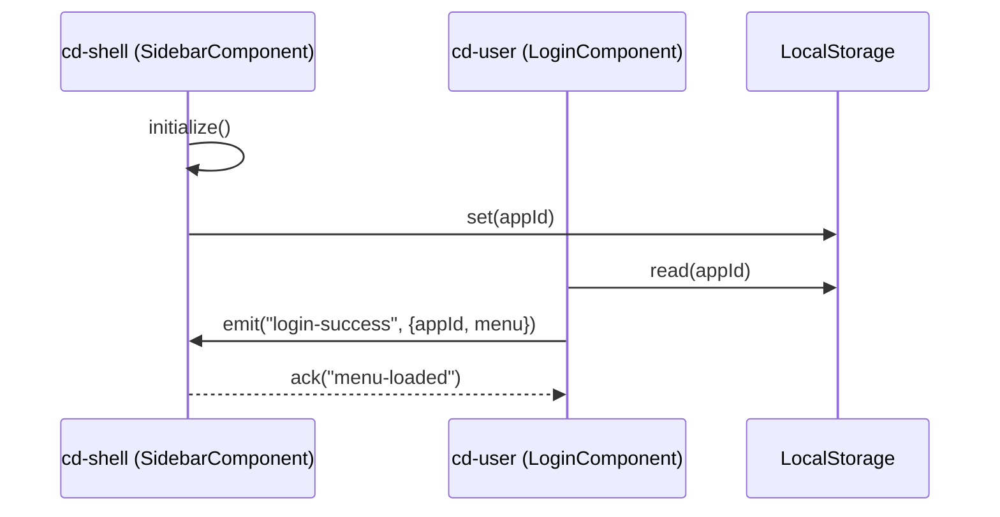
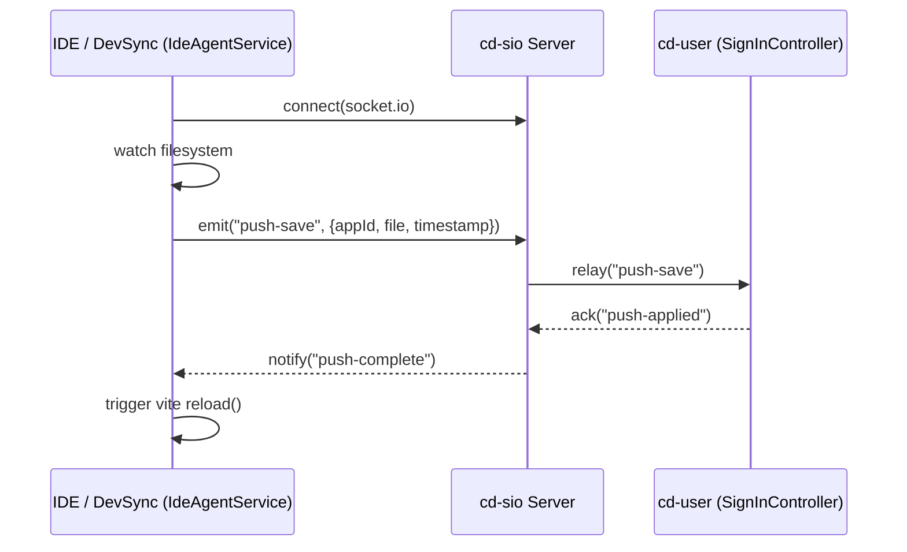

Excellent — you’ve just outlined a very important evolution of **Corpdesk’s live development ecosystem**: from *intra-module federation communication* to *real-time IDE–PWA runtime collaboration*.

Below is a **structured, developer-oriented Markdown guide** that connects these concepts into one coherent framework — showing how the **existing login notification system** used between federated modules (case 1) directly informs the **DevSync mechanism** (case 2).

---

# 🧭 Developer Guide: Bi-Directional Communication Between Federated Modules and DevSync Runtime

## 1. Overview

This guide explains how Corpdesk’s **real-time inter-module communication model**—originally proven in *module federation* between **`cd-shell`** and **`cd-user`**—can be **extended and adapted** for IDE ↔ PWA runtime synchronization.

Both systems share the same design philosophy:

* **Bi-directional awareness** (each actor knows its peer),
* **Shared application identity (`appId`)**, and
* **Push-based event notification** (through `cd-push` → `SioClientService` → `socket.io`).

---

## 2. Underlying Mission

> Develop a mechanism where saving code in the IDE automatically:
>
> 1. Triggers a **custom compilation process** into the runtime “view” directory,
> 2. Pushes an event to the **running PWA instance**,
> 3. Causes the **PWA browser to refresh or hot-reload**, and
> 4. Reports the update status back to the IDE.

---

## 3. Conceptual Parallels

| Concept                   | Module Federation (Login System)      | DevSync (IDE ↔ PWA)                                |
| :------------------------ | :------------------------------------ | :------------------------------------------------- |
| **Actor 1 (Host)**        | `cd-shell` → `SidebarComponent`       | `dev-sync` → `IdeAgentService`                     |
| **Actor 2 (Remote)**      | `cd-user` → `LoginComponent`          | `cd-user` → `SignInController`                     |
| **Communication Channel** | `LocalStorage` + `window.postMessage` | `CdStorage` + `socket.io` (via `SioClientService`) |
| **Identity Management**   | Shared `appId` generated by shell     | Shared `appId` generated by shell                  |
| **Event Type**            | Login Status Notification             | Save/Compile Notification                          |
| **Response Type**         | Menu Payload                          | Runtime Update Acknowledgment                      |
| **Directionality**        | Remote → Host                         | Bi-directional                                     |

---

## 4. Case 1 – Module Federation: Login Status Propagation

### 🔹 Actor 001 – `cd-shell` (Host)

**Component:** `SidebarComponent`

#### Responsibilities

1. Initialize the shared environment (`initialize()`).
2. Generate and persist a global `appId` in **`LocalStorage`**.
3. Subscribe to login notifications from `cd-user`.
4. On login success:

   * Receive `menu` payload from remote.
   * Merge into shell navigation.
   * Update UI state accordingly.

#### Flow



### 🔹 Actor 002 – `cd-user` (Remote)

**Component:** `LoginComponent`

#### Responsibilities

1. Authenticate user credentials.
2. Upon successful login:

   * Retrieve shared `appId` from LocalStorage.
   * Package menu and session data.
   * Push notification back to the host (`SidebarComponent`).

---

## 5. Case 2 – IDE ↔ PWA Runtime Communication (DevSync)

This extends the same philosophy beyond module federation — now **the IDE acts as the “shell” module**, and the **PWA runtime** acts as remote module.

### 🔹 Actor 003 – `IdeAgentService`

**Component:** `IdeAgentService`
**Module Type:** PWA Development Utility (module push initiator)

#### Responsibilities

1. Initialize environment:

   * Generate and store shared `appId` in **`CdStorage`**.
   * Establish socket.io connection via `SioClientService`.
2. Watch for developer file save events.
3. On save:

   * Run a **custom compilation** → output to `view/` directory.
   * Send a structured **push message** (using `ICdPushEnvelop`) to runtime.
   * Trigger Vite to **reload the runtime browser**.
4. Listen for runtime acknowledgment.

#### Flow



---

### 🔹 Actor 004 – `` (Runtime)

**Component:** `IdeAgentService`
**Module Type:** PWA Development Utility (module push node)

#### Responsibilities

1. Listen for push events from `SioClientService`.
2. On “save” message:

   * Reload or patch the current view dynamically.
   * Send back status confirmation to the IDE via `cd-sio`.

---

## 6. Shared Concepts

| Element                | Description                                                                                                                 |
| :--------------------- | :-------------------------------------------------------------------------------------------------------------------------- |
| **`appId`**            | Globally unique identifier shared between IDE and runtime, ensuring both ends refer to the same environment.                |
| **`CdStorage`**        | Replacement for browser `LocalStorage`; supports richer metadata and better lifecycle management in the Corpdesk ecosystem. |
| **`SioClientService`** | Manages socket.io connectivity, event listening, and push message dispatching for both IDE and runtime ends.                |
| **`ICdPushEnvelop`**   | Structured message format used to encapsulate push data (sender, receiver, timestamp, payload, triggerEvent, etc.).         |
| **`initialize()`**     | Common startup method used across modules — to be standardized as `init()` in Corpdesk RFC.                                 |

---

## 7. Login Process Context: Learning from Socket.io Initialization

The login event exchange in module federation helped establish **a repeatable initialization pattern** for socket.io sessions:

### Steps

1. **Shell (`cd-shell`) initializes:**

   * Sets `appId` and environment variables in `LocalStorage`.
2. **Remote (`cd-user`) loads:**

   * Reads `appId` to join shared context.
3. **Remote authenticates and sends push:**

   * Uses `SioClientService.initSio()` to emit `push-registered-client`.
4. **Shell listens for events:**

   * Handles incoming payloads through secure listeners.

This same flow is mirrored for DevSync:

* `dev-sync` plays the role of **remote initiator (IDE)**.
* The PWA runtime plays the role of **host listener (runtime)**.

---

## 8. Future Implementation Goals

| Goal                             | Description                                                                                                |
| :------------------------------- | :--------------------------------------------------------------------------------------------------------- |
| **Unify initialization pattern** | Replace `connect()` in DevSync with `initialize()` → `setAppId()` → `register()`.                          |
| **Integrate CdStorage globally** | Provide a shared access layer for runtime state, replacing localStorage where applicable.                  |
| **Introduce event registry**     | Standardize all socket events (`push-save`, `push-applied`, `push-complete`, etc.) under `CdPushEventMap`. |
| **Add incremental compilation**  | Enable selective rebuild of only changed modules before notifying runtime.                                 |
| **Enhance push security**        | Use JWT-based signing for IDE-to-runtime communications.                                                   |
| **Hot reload orchestration**     | Move from full reload to diff-based patch updates via Vite middleware.                                     |

---

## 9. Summary

The **DevSync architecture** is a **natural extension** of the proven **module federation communication model**.
Where module federation enabled modular runtime interactivity, DevSync extends that interactivity **into the development lifecycle itself** — enabling:

* 🔁 Continuous IDE–Runtime synchronization
* 🚀 Instant feedback on code changes
* 🧠 Shared identity and context through `appId`
* 🧩 Full alignment with Corpdesk modular design principles

---

## 10. Concept Diagram

```mermaid
graph TD
    subgraph Module Federation
        A1[SidebarComponent<br>cd-shell] -->|appId + Login Event| A2[LoginComponent<br>cd-user]
        A2 -->|Menu Payload + Status| A1
    end

    subgraph DevSync Flow
        B1[IdeAgentService<br>dev-sync] -->|Save → Push Event| B2[SignInController<br>cd-user (runtime)]
        B2 -->|Ack → Push Complete| B1
    end

    A1 -.->|Pattern Extended To...| B1
    A2 -.->|Runtime Parity| B2
```

---

### 📘 Developer Note

> The same communication principles used for **login event propagation** now drive **development-time live synchronization**.
>
> Once the `initialize()` and `setAppId()` pattern is harmonized across all modules (including IDE utilities), Corpdesk will achieve a unified, bi-directional runtime framework — spanning from **code authoring** to **live application execution**.

---

Would you like me to extend this document into a **“DevSync Architecture RFC”** (e.g., `corpdesk-rfc-0007-devsync.md`), capturing formal conventions for `initialize()`, `setAppId()`, and `register()` across IDE and runtime modules? It would serve as the canonical standard for all subsequent DevSync-related implementations.
