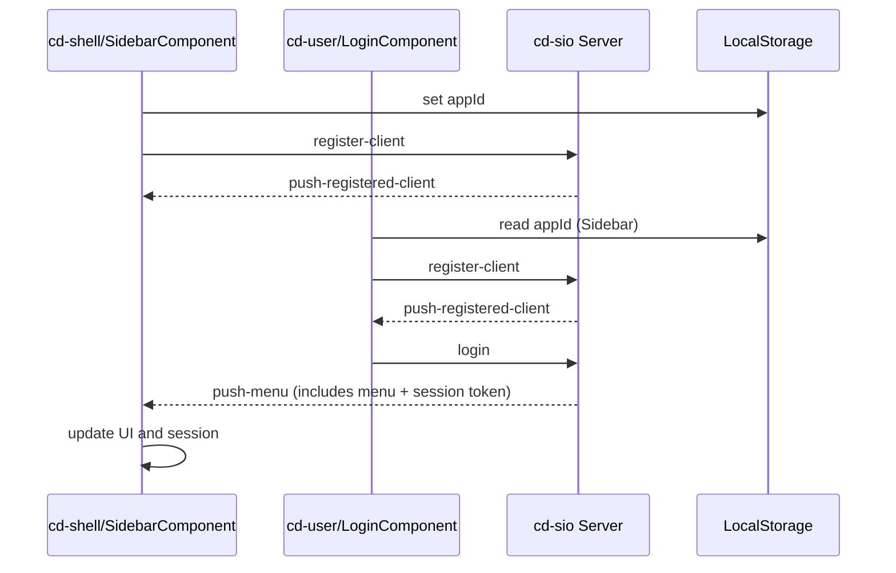

Excellent — these two source files are perfect for documentation because they show **the full handshake lifecycle** between `cd-shell` and `cd-user` modules over the `cd-sio` event-driven infrastructure.
Here’s a detailed **developer guide** (in Markdown format) that explains how these two modules collaborate through socket.io within the Corpdesk Module Federation and how this process directly inspires the **IDE ↔ PWA runtime synchronization design** (the dev-sync mechanism).

---

# 🧭 Corpdesk Inter-Module Communication Guide

## Overview

This document provides a **developer-level explanation** of how Corpdesk modules communicate bi-directionally over `cd-sio` using structured event envelopes.
It uses the relationship between:

* **`cd-shell/SidebarComponent`** (host module)
* **`cd-user/LoginComponent`** (remote module)

to illustrate how authentication and runtime synchronization happen through a structured event pipeline.

The same design pattern forms the basis for **IDE → PWA runtime synchronization**, enabling live code updates during development.

---

## 1. Background

Corpdesk is built using **Module Federation**, allowing different modules to operate semi-independently while still sharing a runtime context.
Communication between these modules follows an **event-driven push model**, mediated by the `cd-sio` (socket.io) server.

Each module instance is uniquely identified by an **`appId`**, which is generated by the host (`cd-shell`) and published for other remotes to read.

This model ensures that even independently loaded microfrontends can communicate as though they were part of one cohesive runtime.

---

## 2. The Core Design Pattern

### 🎭 Actors

| Actor ID | Module     | Type   | Component          | Role                                              |
| -------- | ---------- | ------ | ------------------ | ------------------------------------------------- |
| 001      | `cd-shell` | Host   | `SidebarComponent` | Initializes shared context and listens for events |
| 002      | `cd-user`  | Remote | `LoginComponent`   | Sends login and menu data back to the shell       |

---

## 3. Communication Flow

### 🪜 Step 1: Host Initialization (`SidebarComponent`)

The `SidebarComponent` performs three core functions during initialization:

#### 1. Registers itself

```ts
this.communicationService.registerSidebar(this);
```

This allows inter-module services to reference it later.

#### 2. Sets a unique `appId`

```ts
localStorage.removeItem("appId");
localStorage.setItem("appId", this.svBase.getGuid());
```

This `appId` is published to `localStorage` so other modules (like `cd-user`) can discover it.

#### 3. Initializes Socket.io client

```ts
this.initSioClient();
```

Inside `initSioClient()`:

* Sets up listeners for all possible `cd-sio` events.
* Builds and sends a `register-client` message using a structured `ICdPushEnvelop`.

Example:

```ts
const envl = this.configPushPayload("register-client", "push-registered-client", 1000);
this.sendSioMessage(envl);
```

---

### 🪜 Step 2: Remote Initialization (`LoginComponent`)

The remote module (`cd-user`) initializes after `cd-shell` and performs a mirror sequence:

#### 1. Searches for the host’s `cdObjId`

It builds a filter to locate the `SidebarComponent`’s object in localStorage.

```ts
const filter: LsFilter = {
  storageType: StorageType.CdObjId,
  cdObjId: {
    appId: localStorage.getItem("appId"),
    resourceName: "SidebarComponent",
    ngModule: "SharedModule"
  },
};
this.sidebarInitData = this.searchLocalStorage(filter);
```

This identifies the correct recipient (Sidebar) for future push messages.

#### 2. Sets up socket listeners

```ts
this.listen("push-registered-client");
this.listen("push-menu");
```

It subscribes to events emitted from the `cd-sio` server.

#### 3. Registers with `cd-sio`

```ts
const envl = this.configPushPayload("register-client", "push-registered-client", 1000);
this.sendSioMessage(envl);
```

---

### 🪜 Step 3: Login and Menu Pushback

Once a login succeeds:

1. The `LoginComponent` creates a session.
2. Builds a `push-menu` envelope.
3. Sends it to the `SidebarComponent`.

```ts
const envl = this.configPushPayload("login", "push-menu", res.data.userData.userId);
envl.pushData.m = res.data.menuData;
envl.pushData.token = res.app_state.sess.cd_token;
this.sendSioMessage(envl);
```

The `SidebarComponent` is already listening for `"push-menu"`, so it receives this event and updates the UI accordingly.

---

## 4. Envelope Structure

Both components use a shared structure for all messages:

```ts
interface ICdPushEnvelop {
  pushData: {
    triggerEvent: string;
    emittEvent: string;
    m: any; // message body
    token: string;
    pushRecepients: any[];
    appSockets: any[];
    commTrack: {
      initTime: number;
      relayTime: number | null;
      delivered: boolean;
      completed: boolean;
    };
  };
  req: any;
  resp: any;
}
```

This format ensures that every communication—login status, menu data, compile trigger, or runtime update—is handled identically.

---

## 5. Parallels with Dev-Sync (IDE ↔ PWA Runtime)

| Aspect          | Module Federation           | Dev-Sync (IDE ↔ PWA)              |
| --------------- | --------------------------- | --------------------------------- |
| Host/Initiator  | `cd-shell/SidebarComponent` | `dev-sync/IdeAgentService`        |
| Remote/Receiver | `cd-user/LoginComponent`    | `cd-user/SignInController`        |
| Shared Identity | `appId` (LocalStorage)      | `appId` (CdStorage)               |
| Event System    | `cd-sio` socket events      | `cd-sio` socket events            |
| Purpose         | Exchange login/menu data    | Exchange compiled runtime updates |
| Trigger         | User login                  | Developer file save               |
| Response        | Load user menu              | Reload live browser instance      |

---

## 6. Communication Lifecycle Summary



---

## 7. Applying This to IDE → Runtime Integration

The same principles apply to development synchronization:

| Step | Action                                                                                                |
| ---- | ----------------------------------------------------------------------------------------------------- |
| 1    | `IdeAgentService` publishes an `appId` and registers with `cd-sio`.                                   |
| 2    | Developer saves code → triggers a compilation and packaging process.                                  |
| 3    | Compiled artifacts are placed in a shared runtime directory.                                          |
| 4    | `IdeAgentService` sends a message (`send-update`) to the running PWA client.                          |
| 5    | The PWA (e.g., `SignInController`) receives the push, refreshes modules, and acknowledges completion. |
| 6    | The IDE listens for confirmation, marking synchronization complete.                                   |

Thus, **module federation’s inter-module communication** becomes the **template for IDE-to-runtime hot-update orchestration**.

---

## 8. Key Takeaways

* The **`appId`** is the fundamental runtime identity linking all communicating entities.
* Every push is an **ICdPushEnvelop**, ensuring predictable message formats.
* **Event symmetry** (same trigger/emitt naming) simplifies cross-module logic.
* The same communication pipeline that synchronizes login state can synchronize **live code states** between IDE and browser.

---

Would you like me to append a **“Developer Checklist”** section at the end (for setting up and testing the same pattern in the IDE↔PWA use case)?
That would make it easier for contributors to replicate this behavior step-by-step.

---
13 October 2025

# Corpdesk Comparative Communication Model (REFINED) 
**Revision: Refined Implementation-Oriented Model**

---

## 1. Overview

This document presents a refined analysis and mapping between:

1. **Module Federation inter-module communication**, and  
2. **IDE ↔ PWA runtime (dev-sync) communication**

The purpose is to provide a conceptual and implementation-level framework that ensures *both* systems operate using consistent initialization and communication principles — centered around `cd-sio` and the shared `appId` mechanism.

This model aligns with **corpdesk-rfc-0004**, focusing on how clients (actors) initialize, communicate, and coordinate through the `cd-sio` service layer.

---

## 2. Underlying Mission

To enable **real-time, bi-directional synchronization** between development (IDE) and live runtime environments within the PWA.

> When a developer saves work, a **custom compilation** process transforms source code to runtime form (“view”), updates the PWA’s running code, and triggers the PWA test environment to reflect those changes instantly.

This mirrors how module federation hosts and remotes synchronize during login and menu loading — the same mechanism extended to **development workflows**.

---

## 3. CASE 1: Module Federation Communication

### Actor 001
| Attribute | Value |
|------------|--------|
| **Module** | `cd-shell` |
| **Type** | `shell` *(module federation host)* |
| **Component** | `SidebarComponent` |

**Communication Description**
- Publishes `appId` in `LocalStorage` for shared access within the module federation ecosystem.  
- Listens for login status from **Actor 002**.  
- Processes login response and loads user menu data.

---

### Actor 002
| Attribute | Value |
|------------|--------|
| **Module** | `cd-user` |
| **Type** | `remote` |
| **Component** | `LoginComponent` |

**Communication Description**
- On login response, notifies **Actor 001** with:
  - User status  
  - Associated menu payload

**Notes**
- **Actor 002** is a *remote child* of **Actor 001**.  
- Both share the same `appId`, created by the shell during launch.  
- By the time **Actor 002** is invoked, **Actor 001** has already initialized and stored `appId` in `LocalStorage`.

---

## 4. CASE 2: IDE ↔ PWA Runtime Communication

### Actor 003
| Attribute | Value |
|------------|--------|
| **Module** | `dev-sync` |
| **Type** | `PWA development utility` |
| **Component** | `IdeAgentService` |

**Communication Description**
- Publishes a new `appId` (GUID) to `CdStorage`, representing the running application session.  
- Listens for **save** events triggered by the developer.  
- On save:
  1. Performs custom compilation from *source* → *view (runtime)* directory.  
  2. Sends a `cd-sio` message to the runtime listener with update metadata.  
  3. Triggers Vite to reload the browser page.  
- Listens for and processes acknowledgment responses from runtime listeners.

---

### Actor 004
| Attribute | Value |
|------------|--------|
| **Module** | `dev-sync` |
| **Type** | `PWA development utility` |
| **Component** | `IdeAgentClientService` |

**Communication Description**
- Listens for **save events** broadcasted from the IDE agent.  
- On receiving a save update:
  - Refreshes or hot-reloads affected runtime components.  
  - Sends acknowledgment back to **Actor 003** confirming completion.

**Notes**
- **Actor 004** operates as part of the *live runtime instance* managed by the same module (`dev-sync`).  
- Both **Actor 003** and **Actor 004** share a common `appId` registered by **Actor 003**.  
- By the time **Actor 004** initializes, **Actor 003** has already published the `appId` to `CdStorage`.

---

## 5. Launch Sequence and Dependency

To maintain deterministic initialization:

1. **Actor 003** (`IdeAgentService`) is launched first.  
   - Generates a new `appId`.  
   - Saves it in `CdStorage`.  
   - Initializes `SioClientService` (cd-sio connection).  
   - Begins event listening.

2. **Actor 004** (`IdeAgentClientService`) is launched next.  
   - Accesses the shared `appId` from `CdStorage`.  
   - Subscribes to the same cd-sio namespace.  
   - Registers as a runtime consumer.

### Implementation Recommendation
While **Actor 004** can be self-started, it is cleaner and safer if **Actor 003** explicitly **spawns or triggers** it — ensuring the shared `appId` is guaranteed to exist.

This may be done through:
```ts
IdeAgentService.initialize(() => {
  IdeAgentClientService.initialize();
});
```
