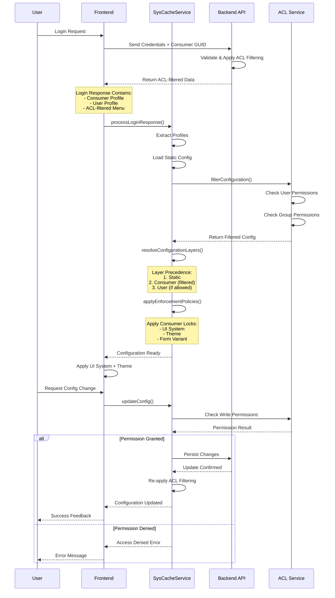
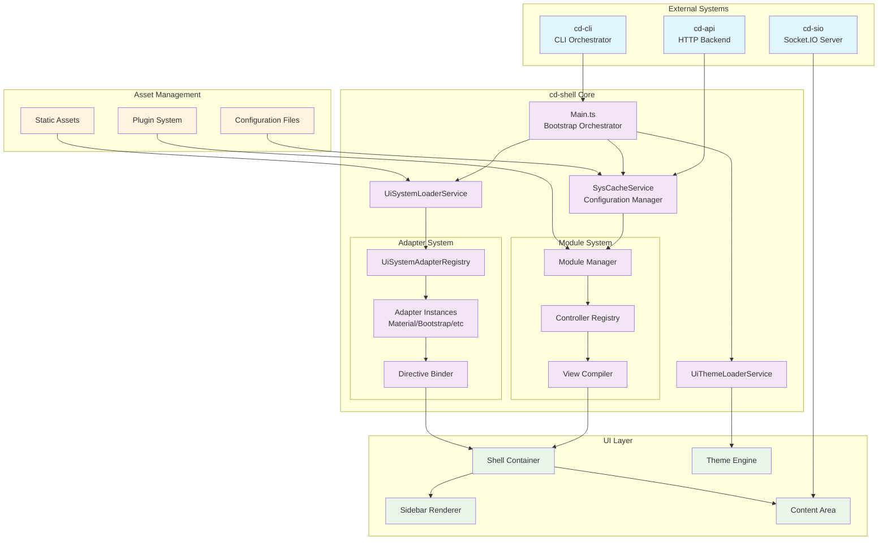
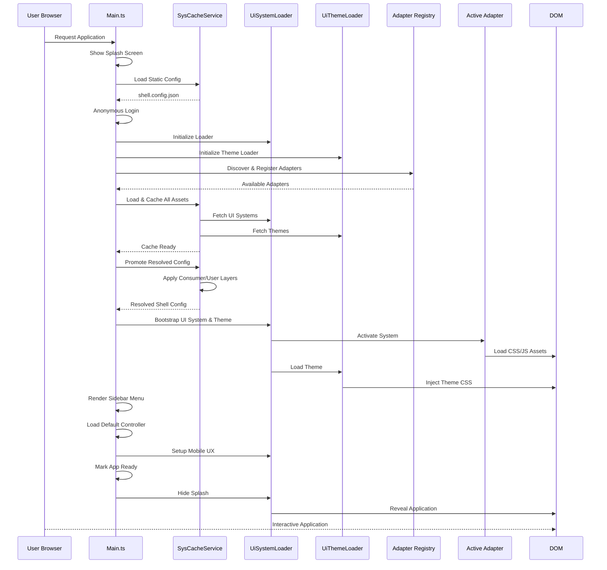
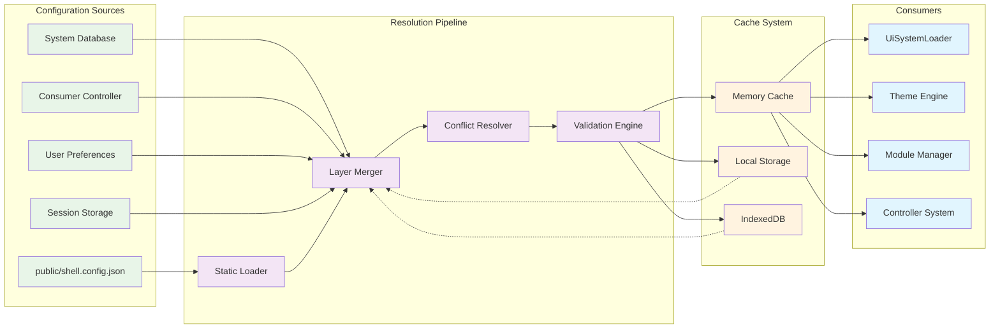

---

# **CorpDesk cd-shell Framework: Technical Documentation**

## **1. Introduction & System Overview**

### **1.1 Project Context**
CorpDesk is a Node.js-based framework designed to automate software development processes through CLI, batch scripts or AI agents. The system comprises several modular components:
- **cd-cli**: CLI-based orchestrator
- **cd-api**: HTTP backend
- **cd-sio**: Socket.IO-based push server (shares codebase with cd-api)
- **cd-shell**: Configurable PWA/Capacitor-based GUI system

This documentation focuses specifically on **cd-shell**, the graphical interface subsystem that enables dynamic UI generation and theming.

### **1.2 Documentation Objectives**
- **Primary Audience**: Contributing developers
- **Standards Alignment**: Designed to qualify for RFC standardization as language-agnostic protocols
- **Intellectual Property**: Suitable as basis for patent applications
- **Scope**: Covers generic HTML scripting, UI adaptation, theming, configuration layers, and system architecture

---

## **2. System Architecture**

### **2.1 Directory Structure**
CorpDesk follows a consistent organizational pattern across all projects:

```
src/CdShell/
├── sys/              # Core framework modules
│   ├── base/         # Foundational components
│   ├── cd-guig/      # GUI Generator (central to UI rendering)
│   ├── moduleman/    # Module management
│   ├── theme/        # Theming system
│   └── [12 other core modules...]
├── app/              # Developer/third-party modules
│   ├── cd-ai/        # AI integration
│   ├── cd-geo/       # Geolocation services
│   └── ui-adaptor-port/ # UI adapter interfaces
├── plugins/          # Platform capability extensions
│   ├── ui/           # UI plugins
│   ├── data/         # Data management
│   └── [6 other plugin categories...]
└── utils/            # Shared utilities
```

**Key Structural Principles:**
1. **Module Organization**: All modules maintain consistent `controllers/`, `models/`, `services/`, and `views/` directories
2. **Separation of Concerns**: Clear distinction between system (`sys`) and application (`app`) code
3. **Plugin Architecture**: Extensible platform capabilities through dedicated plugin directories

### **2.2 Asset Management**
```
public/
├── assets/
│   ├── ui-systems/           # UI framework implementations
│   │   ├── bootstrap-538/
│   │   ├── material-design/
│   │   └── [5 other UI systems...]
│   └── css/fonts/images/     # Static resources
├── themes/                   # Visual theme definitions
│   ├── default/
│   ├── dark/
│   └── common/forms/        # Form variants
└── splashscreens/           # Startup visuals
```

---

## **3. Bootstrapping Process**

### **3.1 Main Application Bootstrap**
The system initializes through `main.ts` with a carefully sequenced bootstrap process:

```typescript
// Simplified boot sequence
async run() {
    // Phase 1: Initialization
    await this.showSplash();
    await this.loadBaseConfig();
    await this.performAnonymousLogin();
    
    // Phase 2: Core Service Setup
    this.initializeCoreServices();
    this.discoverAndRegisterUiAdapters();
    await this.loadStaticCache();
    
    // Phase 3: Configuration Resolution
    await this.promoteResolvedShellConfig();
    
    // Phase 4: UI System Activation
    await this.bootstrapUiSystemAndTheme();
    await this.applyThemeConfiguration();
    
    // Phase 5: UI Rendering
    await this.prepareAndRenderMenu();
    await this.loadDefaultController();
    this.setupMobileUX();
    
    // Phase 6: Application Ready
    this.markAppAsReady();
}
```

### **3.2 Critical Boot Components**
1. **UiSystemLoaderService**: Manages UI framework loading and activation
2. **UiThemeLoaderService**: Handles theme loading and application
3. **SysCacheService**: Orchestrates configuration data with multi-layered resolution
4. **UiSystemAdapterRegistry**: Discovers and manages UI adapter implementations

---

## **4. Configuration System**

### **4.1 Configuration Interface**
```typescript
export interface IShellConfig {
    // Application Identity
    appName: string;
    appVersion?: string;
    appDescription?: string;
    
    // Theming
    themeConfig?: ThemeShellConfig;
    
    // Runtime Behavior
    defaultModulePath?: string;
    logLevel?: LogLevel;
    
    // UI System Preferences
    uiConfig?: UiShellConfig;
    
    // Configuration Origin
    source?: "system" | "consumer" | "user";
    
    // Startup Experience
    splash: {
        enabled: boolean;
        path: string;
        minDuration: number;
    };
    
    // Environment Settings
    envConfig?: EnvConfig;
}
```

### **4.2 Configuration Resolution Pipeline**
1. **Static Configuration**: `public/shell.config.json` (fallback/default)
2. **System Configuration**: Framework-level defaults
3. **Consumer Configuration**: Tenant-specific settings (multi-tenant support)
4. **User Configuration**: Individual user preferences
5. **Runtime Resolution**: SysCacheService orchestrates layer precedence

### **4.3 Multi-Tenant Configuration Management**
- **Consumer Controller**: Primary authority for tenant data
- **Root User Interface**: Administrative controls for UI system/theme selection
- **Privilege-Based Customization**: User-level visual control (e.g., dark/light themes)

---

## **5. Generic HTML Scripting System**

### **5.1 Development Workflow**
The cd-shell employs an Angular-inspired templating system where developers write controller logic that compiles to executable view modules.

**Development Path:**
```
Developer writes → src/CdShell/sys/cd-user/controllers/sign-in.controller.ts
Compilation produces → src/CdShell/sys/cd-user/view/sign-in.controller.js
Runtime execution → Processed via view/index.js aggregation
```

### **5.2 Controller Lifecycle**
Each controller implements a standardized lifecycle with explicit hooks:

```javascript
export const ctlSignIn = {
    // Initialization: Form construction and binder setup
    __init() { /* ... */ },
    
    // Template Definition: Returns HTML markup
    __template() { /* ... */ },
    
    // DOM Setup: Event binding after template rendering
    __setup() { /* ... */ },
    
    // View Activation: Re-establish bindings on view injection
    async __activate() { /* ... */ },
    
    // View Deactivation: Cleanup on view removal
    __deactivate() { /* ... */ },
    
    // Business Logic: Custom methods
    async auth() { /* ... */ }
};
```

### **5.3 Form Management System**
The framework provides reactive form controls with validation:

```javascript
// Form Construction
this.form = new CdFormGroup({
    userName: new CdFormControl("", [
        CdValidators.required("Username is required")
    ]),
    password: new CdFormControl("", [
        CdValidators.required("Password is required"),
        CdValidators.minLength(4, "Password must be at least 4 characters")
    ])
});

// Directive Binding
this.binder = new CdDirectiveBinderService(this.form, "#signInForm", this);
```

### **5.4 Template Compilation & Aggregation**
**View Module Index File:**
```javascript
// src/CdShell/sys/cd-user/view/index.js
export const cdUserModule = {
    ctx: "sys",
    isDefault: true,
    moduleId: "cd-user",
    moduleName: "Auto-Generated Module",
    
    controllers: [
        { 
            name: "sign-in", 
            instance: ctlSignIn, 
            template: ctlSignIn.__template(),
            default: true 
        }
        // Additional controllers...
    ],
    
    menu: [
        {
            label: 'cd-user',
            route: 'sys/cd-user',
            children: [
                { 
                    label: 'sign-in', 
                    itemType: 'route',  
                    route: 'sys/cd-user/sign-in',
                    template: ctlSignIn.__template() 
                }
            ]
        }
    ]
};
```

### **5.5 Advanced Controller Example**
```javascript
// Consumer Configuration Controller
export const ctlConsumerResource2 = {
    // Dependencies
    svConfig: null,
    sysCache: null,
    resolvedShellConfig: null,
    
    // Lifecycle
    async __init() {
        this.svConfig = new ConfigService();
        this.sysCache = SysCacheService.getInstance(this.svConfig);
        this.initializeForm();
    },
    
    async __setup() {
        await this.sysCache.ensureReady();
        this.resolvedShellConfig = this.sysCache.get("shellConfig") || {};
    },
    
    async __afterInit() {
        this.populateFormFromConfig();
        if (this.binder?.refreshView) this.binder.refreshView();
    },
    
    // Template with Custom Elements
    __template() {
        return `
            <div class="cd-panel">
                <h2>Consumer Shell Configuration</h2>
                <form id="consumerShellConfigForm" class="cd-form">
                    <cd-tabs id="shellConfigTabs" active-tab="tab-identity">
                        <cd-tab id="tab-identity" icon="fingerprint" label="Identity">
                            <!-- Form fields... -->
                        </cd-tab>
                    </cd-tabs>
                    <button cdButton (click)="onSave()">Save Configuration</button>
                </form>
            </div>
        `;
    },
    
    // Configuration Management
    async onSave() {
        const patch = {
            appName: this.form.value.appName,
            logLevel: this.form.value.logLevel,
            splash: { /* ... */ },
            source: "consumer"
        };
        await this.svConfig.updateConsumerShellConfig(patch);
    }
};
```

---

## **6. UI Adaptation System**

### **6.1 GUI Generator (GUIG) Module**
The **cd-guig** module implements the Graphic User Interface Generator, following CorpDesk's philosophy of managing GUI as a dynamic, autonomously configurable interface.

**Core Services:**
1. **UiSystemLoaderService**: Manages UI framework loading and activation
2. **UiThemeLoaderService**: Handles theme loading and application
3. **BaseUiAdaptor**: Abstract base class for all UI adapters

### **6.2 UI System Loader Service**

#### **6.2.1 System Discovery & Registration**
```typescript
export class UiSystemLoaderService {
    private static instance: UiSystemLoaderService | null = null;
    private activeSystem: UiSystemDescriptor | null = null;
    private sysCache!: SysCacheService;
    
    // Singleton pattern with dependency injection
    public static getInstance(sysCache?: SysCacheService): UiSystemLoaderService {
        if (!UiSystemLoaderService.instance) {
            if (!sysCache) throw new Error("SysCacheService required on first call");
            UiSystemLoaderService.instance = new UiSystemLoaderService(sysCache);
        }
        return UiSystemLoaderService.instance;
    }
    
    // System discovery from configured paths
    async fetchAvailableSystems(uiConfig: UiConfig): Promise<UiSystemDescriptor[]> {
        const baseFolder = uiConfig.uiSystemBasePath || "/public/assets/ui-systems/";
        const systemIds = UiSystemAdapterRegistry.list();
        const descriptors: UiSystemDescriptor[] = [];
        
        for (const id of systemIds) {
            try {
                const descriptorUrl = `${baseFolder}${id}/descriptor.json`;
                const res = await fetch(descriptorUrl);
                const json = await res.json();
                
                descriptors.push({
                    ...json,
                    id, // Ensure consistent ID
                    cssUrl: json.cssUrl ? `${baseFolder}${id}/${json.cssUrl}` : undefined,
                    jsUrl: json.jsUrl ? `${baseFolder}${id}/${json.jsUrl}` : undefined,
                    stylesheets: (json.stylesheets || []).map((file: string) => 
                        `${baseFolder}${id}/${file}`),
                    scripts: (json.scripts || []).map((file: string) => 
                        `${baseFolder}${id}/${file}`),
                    conceptMappings: json.conceptMappings || {},
                    directiveMap: json.directiveMap || {}
                });
            } catch (err) {
                // Fallback to minimal descriptor
                descriptors.push(this.createFallbackDescriptor(id, baseFolder));
            }
        }
        return descriptors;
    }
}
```

#### **6.2.2 UI System Activation Pipeline**
```typescript
public async activate(id: string): Promise<void> {
    // 1. Cache readiness check
    await this.sysCache.ensureReady();
    
    // 2. Descriptor resolution (cache → fallback)
    const descriptor = this.getFullDescriptor(id) || this.createFallbackDescriptor(id);
    this.activeSystem = descriptor;
    
    // 3. Adapter retrieval and metadata setup
    const adapter = UiSystemAdapterRegistry.get(id);
    adapter.setMeta({
        id: descriptor.id,
        name: descriptor.name,
        version: descriptor.version,
        status: descriptor.deprecated ? "MARKED_FOR_DEPRECATION" : "ACTIVE"
    });
    
    // 4. Global runtime exposure
    (window as any).CdActiveUiDescriptor = descriptor;
    (window as any).CD_ACTIVE_UISYSTEM = id;
    (window as any).CdShellActiveUiSystem = id;
    
    // 5. Asset management (CSS/JS loading)
    await this.loadSystemAssets(descriptor, id);
    
    // 6. Adapter activation
    if (adapter && typeof adapter.activate === "function") {
        await adapter.activate(descriptor);
    }
}
```

#### **6.2.3 Theme Application**
```typescript
public async applyTheme(systemId: string, themeId: string): Promise<void> {
    const adapter = UiSystemAdapterRegistry.get(systemId);
    if (!adapter) return;
    
    // Theme descriptor resolution from cache
    const descriptors = this.sysCache.get("themeDescriptors") || [];
    const themeDescriptor = descriptors.find((d: any) => d.id === themeId);
    
    // Adapter-specific theme application
    await adapter.applyTheme(themeDescriptor || themeId);
}
```

#### **6.2.4 Bootstrap Orchestration**
```typescript
async bootstrapUiSystemAndTheme(svSysCache: SysCacheService): Promise<void> {
    // 1. Cache readiness
    await svSysCache.ensureReady();
    const uiConfig = svSysCache.get("uiConfig") as UiConfig;
    
    // 2. UI System activation
    await this.activate(uiConfig.defaultUiSystemId);
    
    // 3. Structural CSS loading
    await this.loadCSS("/themes/common/base.css", "shell-base");
    await this.loadCSS("/assets/css/index.css", "shell-index");
    
    // 4. Theme asset loading
    await UiThemeLoaderService.getInstance(svSysCache)
        .loadThemeById(uiConfig.defaultThemeId);
    
    // 5. Theme normalization and caching
    const rawTheme = svSysCache.getThemeById(uiConfig.defaultThemeId);
    const normalizedTheme = rawTheme ? 
        UiThemeNormalizer.normalize(rawTheme, {
            uiSystemId: uiConfig.defaultUiSystemId,
            source: "static"
        }) : null;
    
    if (normalizedTheme) {
        svSysCache.set("theme:normalized", normalizedTheme, "runtime");
    }
    
    // 6. Legacy-compatible theme application
    await this.applyTheme(uiConfig.defaultUiSystemId, uiConfig.defaultThemeId);
}
```

---

## **7. Theming System**

### **7.1 Theme Loader Service**

```typescript
export class UiThemeLoaderService {
    private static readonly ACTIVE_THEME_KEY = "cd-active-theme-id";
    private static readonly ACTIVE_FORM_VARIANT_KEY = "cd-active-form-variant";
    private static instance: UiThemeLoaderService | null = null;
    
    // Theme discovery and loading
    public async fetchAvailableThemes(uiConfig: UiConfig): Promise<any> {
        const accessible = uiConfig?.accessibleThemes || ["default", "dark"];
        const descriptors: any[] = [];
        
        for (const id of accessible) {
            try {
                const path = `/themes/${id}/theme.json`;
                const res = await fetch(path);
                if (!res.ok) continue;
                const desc = await res.json();
                descriptors.push(desc);
            } catch (err) {
                console.warn(`Error fetching theme descriptor`, err);
            }
        }
        
        return {
            themes: descriptors.map(d => ({ id: d.id, name: d.name })),
            variants: [
                { id: "standard", name: "Standard" },
                { id: "compact", name: "Compact" },
                { id: "floating", name: "Floating" }
            ],
            descriptors,
            uiConfig
        };
    }
    
    // Theme application with CSS injection
    public async loadThemeById(themeId: string): Promise<void> {
        // Clean previous theme assets
        document.querySelectorAll("link[data-cd-theme]").forEach(l => l.remove());
        
        const desc = this.getThemeDescriptor(themeId);
        const cssPath = desc?.css || desc?.cssPath || `/themes/${themeId}/theme.css`;
        
        await this.injectStyle(cssPath, themeId, "theme");
    }
    
    // Form variant management
    public async loadFormVariant(formType = "standard"): Promise<void> {
        document.querySelectorAll("link[data-cd-form]").forEach(el => el.remove());
        const path = `/themes/common/forms/variants/cd-form-${formType}.css`;
        await this.injectStyle(path, formType, "form");
    }
}
```

---

## **8. UI Adapter System**

### **8.1 Base Adapter Architecture**

#### **8.1.1 Abstract Base Class**
```typescript
export abstract class BaseUiAdaptor {
    protected meta: UiSystemMeta = {
        id: '',
        name: '',
        version: '',
        status: 'ACTIVE'
    };
    
    protected themeRegistry: Map<string, any> = new Map();
    protected directiveRegistry: Map<string, Function> = new Map();
    
    // Core lifecycle methods
    abstract activate(descriptor: UiSystemDescriptor): Promise<void>;
    abstract deactivate(): Promise<void>;
    abstract applyTheme(themeDescriptor: any | string): Promise<void>;
    
    // Directive registration
    abstract registerDirectives(): void;
    
    // Concept mapping
    abstract mapConcepts(source: string, targetSystem: string): any;
    
    // Utility methods
    setMeta(meta: Partial<UiSystemMeta>): void {
        this.meta = { ...this.meta, ...meta };
    }
    
    getMeta(): UiSystemMeta {
        return this.meta;
    }
}
```

#### **8.1.2 Adapter Registry System**
```typescript
export class UiSystemAdapterRegistry {
  private static registry = new Map<string, IUiSystemAdapter>();

  static register(id: string, adapter: IUiSystemAdapter) {
    console.log("[UiSystemAdapterRegistry] register:", id, adapter);
    this.registry.set(id, adapter);
  }

  static get(id: string): IUiSystemAdapter | null {
    return this.registry.get(id) || null;
  }

  static list(): string[] {
    return Array.from(this.registry.keys());
  }
  
}
```

### **8.2 Concrete Adapter Implementations**

#### **8.2.1 Material Design Adapter**
```typescript
export class MaterialDesignAdapterService extends BaseUiAdaptor {
    private materialInstance: any = null;
    
    constructor() {
        super();
        this.meta = {
            id: 'material-design',
            name: 'Material Design',
            version: '3.0.0',
            status: 'ACTIVE'
        };
    }
    
    async activate(descriptor: UiSystemDescriptor): Promise<void> {
        console.log(`[MaterialDesignAdapter] Activating ${descriptor.id}`);
        
        // 1. Register directives specific to Material Design
        this.registerDirectives();
        
        // 2. Initialize Material Design components if JS is available
        if (descriptor.jsUrl && typeof window !== 'undefined') {
            await this.initializeMaterialComponents(descriptor);
        }
        
        // 3. Apply default theme if specified
        if (descriptor.themeActive) {
            await this.applyTheme(descriptor.themeActive);
        }
        
        // 4. Set up global event listeners
        this.setupGlobalListeners();
        
        console.log(`[MaterialDesignAdapter] Activation complete`);
    }
    
    registerDirectives(): void {
        this.directiveRegistry.set('md-button', this.renderMaterialButton.bind(this));
        this.directiveRegistry.set('md-card', this.renderMaterialCard.bind(this));
        this.directiveRegistry.set('md-form-field', this.renderMaterialFormField.bind(this));
        this.directiveRegistry.set('md-ripple', this.applyRippleEffect.bind(this));
        
        // Map generic directives to Material Design equivalents
        this.directiveRegistry.set('cdButton', this.renderMaterialButton.bind(this));
        this.directiveRegistry.set('cdCard', this.renderMaterialCard.bind(this));
    }
    
    async applyTheme(themeDescriptor: any | string): Promise<void> {
        const themeId = typeof themeDescriptor === 'string' 
            ? themeDescriptor 
            : themeDescriptor.id;
        
        console.log(`[MaterialDesignAdapter] Applying theme: ${themeId}`);
        
        // 1. Remove previous theme classes
        document.body.classList.remove('md-theme-dark', 'md-theme-light');
        
        // 2. Apply theme-specific classes
        if (themeId.includes('dark')) {
            document.body.classList.add('md-theme-dark');
        } else {
            document.body.classList.add('md-theme-light');
        }
        
        // 3. Inject theme-specific CSS variables
        await this.injectThemeVariables(themeDescriptor);
        
        // 4. Update component theming
        this.updateComponentTheming(themeDescriptor);
        
        // 5. Store in registry
        this.themeRegistry.set(themeId, themeDescriptor);
    }
    
    private renderMaterialButton(element: HTMLElement, config: any): void {
        element.classList.add('mdc-button', 'mdc-button--raised');
        
        // Add ripple effect
        const rippleSpan = document.createElement('span');
        rippleSpan.className = 'mdc-button__ripple';
        element.appendChild(rippleSpan);
        
        // Add label
        const labelSpan = document.createElement('span');
        labelSpan.className = 'mdc-button__label';
        labelSpan.textContent = config.label || element.textContent;
        element.appendChild(labelSpan);
        
        // Add touch event handling
        element.addEventListener('click', (e) => {
            this.handleMaterialButtonClick(e, element);
        });
    }
    
    // Additional Material Design specific implementations...
}
```

#### **8.2.2 Bootstrap 5 Adapter**
```typescript
export class Bootstrap538AdapterService extends BaseUiAdaptor {
    private bsComponents: Map<string, any> = new Map();
    
    constructor() {
        super();
        this.meta = {
            id: 'bootstrap-538',
            name: 'Bootstrap 5.3.8',
            version: '5.3.8',
            status: 'ACTIVE'
        };
    }
    
    async activate(descriptor: UiSystemDescriptor): Promise<void> {
        console.log(`[BootstrapAdapter] Activating ${descriptor.id}`);
        
        // 1. Check for Bootstrap global availability
        if (!(window as any).bootstrap) {
            console.warn('Bootstrap JS not loaded globally, components may not initialize');
        }
        
        // 2. Register Bootstrap-specific directives
        this.registerDirectives();
        
        // 3. Initialize data-bs attributes
        this.initializeDataAttributes();
        
        // 4. Set up responsive behavior
        this.setupResponsiveBehaviors();
        
        console.log(`[BootstrapAdapter] Activation complete`);
    }
    
    registerDirectives(): void {
        this.directiveRegistry.set('bs-btn', this.renderBootstrapButton.bind(this));
        this.directiveRegistry.set('bs-modal', this.renderBootstrapModal.bind(this));
        this.directiveRegistry.set('bs-dropdown', this.renderBootstrapDropdown.bind(this));
        this.directiveRegistry.set('bs-form-control', this.renderBootstrapFormControl.bind(this));
        
        // Map generic directives
        this.directiveRegistry.set('cdButton', this.renderBootstrapButton.bind(this));
        this.directiveRegistry.set('cdModal', this.renderBootstrapModal.bind(this));
    }
    
    async applyTheme(themeDescriptor: any | string): Promise<void> {
        const themeId = typeof themeDescriptor === 'string' 
            ? themeDescriptor 
            : themeDescriptor.id;
        
        console.log(`[BootstrapAdapter] Applying theme: ${themeId}`);
        
        // 1. Update CSS variables for Bootstrap theming
        await this.updateBootstrapVariables(themeDescriptor);
        
        // 2. Apply theme classes to document
        if (themeDescriptor.classes) {
            themeDescriptor.classes.forEach((cls: string) => {
                document.body.classList.add(cls);
            });
        }
        
        // 3. Re-initialize Bootstrap components with new theme
        this.reinitializeBootstrapComponents();
        
        // 4. Store theme
        this.themeRegistry.set(themeId, themeDescriptor);
    }
    
    private renderBootstrapButton(element: HTMLElement, config: any): void {
        // Add base Bootstrap classes
        element.classList.add('btn');
        
        // Apply variant
        const variant = config.variant || 'primary';
        element.classList.add(`btn-${variant}`);
        
        // Apply size if specified
        if (config.size) {
            element.classList.add(`btn-${config.size}`);
        }
        
        // Apply outline style if specified
        if (config.outline) {
            element.classList.remove(`btn-${variant}`);
            element.classList.add(`btn-outline-${variant}`);
        }
        
        // Initialize tooltip if data-bs-toggle="tooltip" is present
        if (element.hasAttribute('data-bs-toggle') && 
            element.getAttribute('data-bs-toggle') === 'tooltip') {
            this.initializeBootstrapTooltip(element);
        }
    }
    
    private initializeDataAttributes(): void {
        // Auto-initialize Bootstrap components based on data attributes
        document.querySelectorAll('[data-bs-toggle="dropdown"]').forEach(el => {
            this.initializeBootstrapDropdown(el as HTMLElement);
        });
        
        document.querySelectorAll('[data-bs-toggle="modal"]').forEach(el => {
            this.initializeBootstrapModal(el as HTMLElement);
        });
        
        // Additional data attribute initializations...
    }
}
```

### **8.3 Directive Binder Service**

```typescript
// src/CdShell/sys/cd-guig/services/cd-directive-binder.service.ts
import { CdFormGroup } from "../controllers/cd-form-group.control";

export class CdDirectiveBinderService {
  private form: CdFormGroup;
  private formElement: HTMLFormElement; 
  private controllerInstance: any;
  private formSelector: string;

  private uiSystem: string = "bootstrap-538"; // <--- NEW (default)
  private eventListeners: {
    element: HTMLElement;
    event: string;
    handler: (e: Event) => void;
  }[] = [];

  constructor(
    form: CdFormGroup,
    formSelector: string,
    controllerInstance: any
  ) {
    console.log("CdDirectiveBinderService::constructor()/start");

    this.form = form;
    this.controllerInstance = controllerInstance;
    this.formSelector = formSelector;

    // NEW: Read UI-System from global runtime selector
    if (typeof window !== "undefined" && window.CD_ACTIVE_UISYSTEM) {
      this.uiSystem = window.CD_ACTIVE_UISYSTEM;
      console.log(
        `[Binder] UI-System set to: ${this.uiSystem} (via window.CD_ACTIVE_UISYSTEM)`
      );
    }
  }

  // -----------------------------------------------------------------
  // BIND DOM
  // -----------------------------------------------------------------
  public async bindToDom(): Promise<void> {
    console.log("[CdDirectiveBinderService][bindToDom] start");

    this.formElement = document.querySelector(
      this.formSelector
    ) as HTMLFormElement;

    if (!this.formElement) {
      console.error(`[Binder] Form not found: ${this.formSelector}`);
      return;
    }

    // Notify UI-System (Bootstrap, Tailwind, Material, etc.)
    this.dispatchLifecycleEvent("cd:form:bound");

    // -----------------------
    // BIND cdFormControl
    // -----------------------
    Object.entries(this.form.controls).forEach(([key, control]) => {
      const input = this.formElement.querySelector(
        `[name="${key}"][cdFormControl]`
      ) as HTMLInputElement;

      if (!input) return;

      const inputHandler = (e: Event) => {
        const target = e.target as HTMLInputElement;
        control.setValue(target.value);
        this.applyValidationStyles({ [key]: control.error });
      };

      const blurHandler = () => {
        control.markAsTouched();
        this.applyValidationStyles({ [key]: control.error });
      };

      input.addEventListener("input", inputHandler);
      input.addEventListener("blur", blurHandler);

      this.eventListeners.push({ element: input, event: "input", handler: inputHandler });
      this.eventListeners.push({ element: input, event: "blur", handler: blurHandler });

      input.value = control.value;
      this.applyValidationStyles({ [key]: control.error });
    });

    // -----------------------
    // BIND (change)="method()"
    // -----------------------
    const elements = this.formElement.querySelectorAll("*");

    elements.forEach((el) => {
      Array.from(el.attributes).forEach((attr) => {
        const match = attr.name.match(/^\(([^)]+)\)$/);
        if (!match) return;

        const eventName = match[1];
        const expression = attr.value;

        const customHandler = (e: Event) =>
          this.invokeDirectiveMethod(expression, e);

        el.addEventListener(eventName, customHandler);

        this.eventListeners.push({
          element: el as HTMLElement,
          event: eventName,
          handler: customHandler,
        });
      });
    });
  }

  // -----------------------------------------------------------------
  // UNBIND DOM
  // -----------------------------------------------------------------
  public unbindAllDomEvents(): void {
    console.log(`[Binder] Unbinding ${this.eventListeners.length} listeners`);

    this.eventListeners.forEach(({ element, event, handler }) => {
      element.removeEventListener(event, handler);
    });

    this.eventListeners = [];

    // Notify UI-System to clean overlays, popovers etc.
    this.dispatchLifecycleEvent("cd:form:unbound");
  }

  // -----------------------------------------------------------------
  // EVENT DISPATCHER FOR UI-SYSTEM
  // -----------------------------------------------------------------
  private dispatchLifecycleEvent(name: string): void {
    const event = new CustomEvent(name, {
      bubbles: true,
      detail: {
        formSelector: this.formSelector,
        uiSystem: this.uiSystem,
        controller: this.controllerInstance,
      },
    });

    document.dispatchEvent(event);
    console.log(`[Binder] Fired event: ${name}`);
  }

  // -----------------------------------------------------------------
  // DIRECTIVE INVOCATION
  // -----------------------------------------------------------------
  private invokeDirectiveMethod(expression: string, event: Event): void {
    try {
      const fnMatch = expression.match(/^([a-zA-Z0-9_]+)\s*\(([^)]*)\)/);
      if (!fnMatch) return;

      const fnName = fnMatch[1];
      const hasEventArg = fnMatch[2]?.includes("$event");

      const controller = this.controllerInstance;

      if (controller && typeof controller[fnName] === "function") {
        controller[fnName].call(controller, hasEventArg ? event : undefined);
      } else {
        console.warn(`[Binder] Method not found: ${fnName}`);
      }
    } catch (err) {
      console.error(`[Binder] Error invoking directive method: ${expression}`, err);
    }
  }

  // -----------------------------------------------------------------
  // VALIDATION STYLING (UI-system will override later)
  // -----------------------------------------------------------------
  validateAll(): void {
    const result = this.form.validateAll();
    this.applyValidationStyles(result);
  }

  applyValidationStyles(result: Record<string, string | null>): void {
    for (const [key, error] of Object.entries(result)) {
      const input = this.formElement.querySelector(
        `[name="${key}"]`
      ) as HTMLInputElement;
      const errorDiv = this.formElement.querySelector(
        `[data-error-for="${key}"]`
      ) as HTMLElement;

      if (!input) continue;

      input.classList.remove("cd-valid", "cd-invalid");
      if (error) {
        input.classList.add("cd-invalid");
        if (errorDiv) errorDiv.textContent = error;
      } else {
        input.classList.add("cd-valid");
        if (errorDiv) errorDiv.textContent = "";
      }
    }
  }
}
```

---

## **9. Configuration Layer System**

### **9.1 Multi-Layer Configuration Architecture**

#### **9.1.1 Configuration Resolution Hierarchy**
```
1. SYSTEM LAYER (Highest Priority)
   └── Framework defaults, core behaviors
   
2. CONSUMER LAYER (Tenant-specific)
   └── Multi-tenant settings, branding
   
3. USER LAYER (Individual preferences)
   └── Personalization, accessibility
   
4. SESSION LAYER (Runtime overrides)
   └── Temporary changes, feature flags
   
5. STATIC LAYER (Fallback)
   └── public/shell.config.json
```

#### **9.1.2 Configuration Interface Definition**
# **CorpDesk Shell Framework: Technical Documentation (Supplement)**

## **9.2. Configuration Privilege and Access Control System**

### **9.2.1 Multi-Layer Configuration Architecture with ACL**

#### **9.2.1.1 Configuration Hierarchy with Privilege Boundaries**
```
┌─────────────────────────────────────────────────────────┐
│                    SYSTEM LAYER                         │
│  ┌───────────────────────────────────────────────────┐  │
│  │ Framework Defaults                               │  │
│  │ • Immutable                                      │  │
│  │ • No user control                                │  │
│  └───────────────────────────────────────────────────┘  │
│                    (Priority: 1)                        │
├─────────────────────────────────────────────────────────┤
│                   CONSUMER LAYER                        │
│  ┌───────────────────────────────────────────────────┐  │
│  │ Tenant Configuration                             │  │
│  │ • Set by consumer admin                          │  │
│  │ • Inherited by all users                         │  │
│  │ • May lock certain UI aspects                    │  │
│  └───────────────────────────────────────────────────┘  │
│                    (Priority: 2)                        │
├─────────────────────────────────────────────────────────┤
│                     USER LAYER                          │
│  ┌───────────────────────────────────────────────────┐  │
│  │ Personal Preferences                             │  │
│  │ • Only if consumer allows personalization        │  │
│  │ • Override specific settings                     │  │
│  │ • Stored in userProfile.shellConfig              │  │
│  └───────────────────────────────────────────────────┘  │
│                    (Priority: 3)                        │
└─────────────────────────────────────────────────────────┘
```

### **9.2.2 Configuration Models and Interfaces**

#### **9.2.2.1 Consumer Configuration Model**
```typescript
/**
 * CONSUMER SHELL CONFIGURATION
 * Defines tenant-wide UI policies and privileges
 */
export interface IConsumerShellConfig extends IShellConfig {
  /**
   * Whether users under this consumer are allowed
   * to personalize their UI system, theme, formVariant
   */
  userPersonalizationAllowed?: boolean;

  /**
   * Default UI settings for this consumer (tenant)
   * These override system defaults, but user settings
   * may override these IF personalization is allowed
   */
  defaultUiSystemId?: string;
  defaultThemeId?: string;
  defaultFormVariant?: string;

  /**
   * Consumer-level enforced UI policies
   * (e.g., lock UI system or theme)
   */
  enforcedPolicies?: {
    lockUiSystem?: boolean;     // Users cannot change UI system
    lockTheme?: boolean;        // Users cannot change theme
    lockFormVariant?: boolean;  // Users cannot change form variant
  };

  /**
   * Field-level permissions for configuration access
   */
  fieldPermissions?: {
    userPermissions: IProfileConsumerUserAccess[];
    groupPermissions: IProfileConsumerGroupAccess[];
  };
}

/**
 * Consumer Profile Access Control
 */
export interface IConsumerProfileAccess {
  userPermissions: IProfileConsumerUserAccess[];
  groupPermissions: IProfileConsumerGroupAccess[];
}

export interface IProfileConsumerUserAccess {
  userId: number;      // User granted access
  field: string;       // Configuration field being controlled
  hidden: boolean;     // Whether field is visible
  read: boolean;       // Can view the setting
  write: boolean;      // Can modify the setting
  execute: boolean;    // Can apply/use the setting
}

export interface IProfileConsumerGroupAccess {
  groupId: number;     // Group controlling access
  field: string;
  hidden: boolean;
  read: boolean;
  write: boolean;
  execute: boolean;
}
```

#### **9.2.2.2 User Configuration Model**
```typescript
/**
 * USER SHELL CONFIGURATION
 * Personal preferences stored in user profile
 */
export interface IUserShellConfig extends IShellConfig {
  /** Flags that user can personalize or not */
  personalizationEnabled?: boolean;

  /**
   * User-specific UI preferences
   * Only applied if consumer allows personalization
   */
  userPreferences?: {
    uiSystemId?: string;     // Preferred UI system
    themeId?: string;        // Preferred theme
    formVariant?: string;    // Preferred form variant
  };

  /**
   * Last applied configuration (for conflict resolution)
   */
  lastApplied?: {
    timestamp: string;
    consumerConfigHash: string;
    appliedSettings: string[];
  };
}
```

### **9.2.3 Login Process and ACL Resolution**

#### **9.2.3.1 Login Request Flow**
```typescript
// Login request structure
const loginRequest = {
  ctx: "Sys",
  m: "User",
  c: "User",
  a: "Login",
  dat: {
    f_vals: [{
      data: {
        userName: "karl",
        password: "********",
        consumerGuid: "B0B3DA99-1839-A499-90F6-1E3F69575DCD"
      }
    }],
    token: null
  },
  args: null
};

// Login response includes ACL-filtered configuration data
const loginResponse = {
  app_state: { success: true, /* ... */ },
  data: {
    consumer: {
      consumerId: 33,
      consumerProfile: {
        shellConfig: { /* Consumer-level configuration */ },
        fieldPermissions: { /* ACL for consumer resources */ }
      }
    },
    userData: {
      userId: 1010,
      userProfile: {
        avatar: { /* ... */ },
        fieldPermissions: { /* ACL for user resources */ },
        shellConfig: { /* User-level preferences */ }
      }
    },
    menuData: [ /* ACL-filtered menu structure */ ]
  }
};
```

#### **9.2.3.2 ACL Filtering Process**
```typescript
/**
 * ACL Filtering Algorithm for Configuration Access
 */
class ConfigurationACLService {
  /**
   * Determine if user can access a specific configuration field
   */
  canAccessConfigField(
    user: IUserProfile,
    consumer: IConsumerProfile,
    field: string,
    action: 'read' | 'write' | 'execute'
  ): boolean {
    // 1. Check user-specific permissions
    const userPerm = user.fieldPermissions?.userPermissions
      .find(p => p.userId === user.userData.userId && p.field === field);
    
    if (userPerm) {
      switch (action) {
        case 'read': return userPerm.read;
        case 'write': return userPerm.write;
        case 'execute': return userPerm.execute;
      }
    }

    // 2. Check group permissions (user's groups)
    const userGroups = this.getUserGroups(user.userId);
    const groupPerm = user.fieldPermissions?.groupPermissions
      .find(p => userGroups.includes(p.groupId) && p.field === field);
    
    if (groupPerm) {
      switch (action) {
        case 'read': return groupPerm.read;
        case 'write': return groupPerm.write;
        case 'execute': return groupPerm.execute;
      }
    }

    // 3. Check consumer-level permissions
    const consumerUserPerm = consumer.fieldPermissions?.userPermissions
      .find(p => p.userId === user.userData.userId && p.field === field);
    
    if (consumerUserPerm) {
      switch (action) {
        case 'read': return consumerUserPerm.read;
        case 'write': return consumerUserPerm.write;
        case 'execute': return consumerUserPerm.execute;
      }
    }

    // 4. Default to consumer group permissions
    const consumerGroupPerm = consumer.fieldPermissions?.groupPermissions
      .find(p => userGroups.includes(p.groupId) && p.field === field);
    
    if (consumerGroupPerm) {
      switch (action) {
        case 'read': return consumerGroupPerm.read;
        case 'write': return consumerGroupPerm.write;
        case 'execute': return consumerGroupPerm.execute;
      }
    }

    // 5. Default deny
    return false;
  }

  /**
   * Filter configuration based on user privileges
   */
  filterConfiguration(
    fullConfig: IShellConfig,
    user: IUserProfile,
    consumer: IConsumerProfile
  ): IShellConfig {
    const filteredConfig: IShellConfig = { ...fullConfig };
    
    // Check each configuration field
    Object.keys(fullConfig).forEach(key => {
      if (!this.canAccessConfigField(user, consumer, key, 'read')) {
        delete filteredConfig[key];
      } else if (!this.canAccessConfigField(user, consumer, key, 'write')) {
        // Mark as read-only
        Object.defineProperty(filteredConfig, key, {
          value: fullConfig[key],
          writable: false,
          enumerable: true,
          configurable: false
        });
      }
    });

    return filteredConfig;
  }
}
```

### **9.2.4 Enhanced SysCacheService with Privilege Management**

#### **9.2.4.1 Revised SysCacheService Implementation**
```typescript
export class SysCacheService {
  private static instance: SysCacheService;
  private cache = new Map<string, any>();
  private listeners = new Map<string, Set<CacheListener<any>>>();
  private versionCounter = 0;

  // Privilege and ACL state
  private userProfile: IUserProfile | null = null;
  private consumerProfile: IConsumerProfile | null = null;
  private aclService: ConfigurationACLService;
  private configService: ConfigService;

  constructor(configService: ConfigService) {
    this.configService = configService;
    this.aclService = new ConfigurationACLService();
  }

  /**
   * Process login response and apply ACL filtering
   */
  public async processLoginResponse(loginData: any): Promise<void> {
    this.logger.debug("[SysCacheService.processLoginResponse] Processing login data");
    
    // Extract profiles from login response
    this.consumerProfile = loginData.data?.consumer?.consumerProfile || null;
    this.userProfile = loginData.data?.userData?.userProfile || null;
    
    // Store raw data
    this.set("consumer:raw", this.consumerProfile, "login");
    this.set("user:raw", this.userProfile, "login");
    
    // Apply ACL filtering to configuration
    await this.applyACLFilteredConfiguration();
    
    // Cache menu data (already ACL-filtered by backend)
    this.set("menu:filtered", loginData.data?.menuData || [], "login");
    
    // Notify listeners
    this.notify("login:complete", {
      userProfile: this.userProfile,
      consumerProfile: this.consumerProfile
    });
  }

  /**
   * Apply ACL filtering to configuration layers
   */
  private async applyACLFilteredConfiguration(): Promise<void> {
    if (!this.userProfile || !this.consumerProfile) {
      throw new Error("Profiles not loaded for ACL filtering");
    }

    // Load static configuration
    const staticConfig = await this.configService.loadConfig();
    
    // Apply consumer configuration (with ACL filtering)
    const consumerConfig = this.consumerProfile.shellConfig || {};
    const filteredConsumerConfig = this.aclService.filterConfiguration(
      consumerConfig,
      this.userProfile,
      this.consumerProfile
    );
    
    // Apply user configuration (if allowed)
    let userConfig = {};
    if (this.consumerProfile.shellConfig?.userPersonalizationAllowed) {
      userConfig = this.userProfile.shellConfig?.userPreferences || {};
    }
    
    // Resolve final configuration with proper precedence
    const resolvedConfig = this.resolveConfigurationLayers(
      staticConfig,
      filteredConsumerConfig,
      userConfig
    );
    
    // Cache resolved configuration
    this.set("shellConfig:resolved", resolvedConfig, "acl-resolved");
    this.set("uiConfig:resolved", resolvedConfig.uiConfig || {}, "acl-resolved");
    this.set("envConfig:resolved", resolvedConfig.envConfig || {}, "acl-resolved");
    
    // Apply enforcement policies
    this.applyEnforcementPolicies(resolvedConfig);
  }

  /**
   * Resolve configuration with proper layer precedence
   */
  private resolveConfigurationLayers(
    staticConfig: IShellConfig,
    consumerConfig: Partial<IShellConfig>,
    userConfig: Partial<IShellConfig>
  ): IShellConfig {
    const baseConfig = { ...staticConfig };
    
    // Apply consumer overrides (with ACL checks already applied)
    Object.keys(consumerConfig).forEach(key => {
      if (consumerConfig[key] !== undefined) {
        baseConfig[key] = consumerConfig[key];
      }
    });
    
    // Apply user preferences (only if consumer allows)
    if (this.consumerProfile?.shellConfig?.userPersonalizationAllowed) {
      Object.keys(userConfig).forEach(key => {
        if (userConfig[key] !== undefined) {
          // Check if this specific field is locked by consumer
          const isLocked = this.isFieldLocked(key);
          if (!isLocked) {
            baseConfig[key] = userConfig[key];
          }
        }
      });
    }
    
    return baseConfig;
  }

  /**
   * Check if a configuration field is locked by consumer policies
   */
  private isFieldLocked(field: string): boolean {
    const policies = this.consumerProfile?.shellConfig?.enforcedPolicies;
    
    switch (field) {
      case 'defaultUiSystemId':
      case 'uiSystemId':
        return policies?.lockUiSystem === true;
        
      case 'defaultThemeId':
      case 'themeId':
        return policies?.lockTheme === true;
        
      case 'defaultFormVariant':
      case 'formVariant':
        return policies?.lockFormVariant === true;
        
      default:
        return false;
    }
  }

  /**
   * Apply enforcement policies to runtime
   */
  private applyEnforcementPolicies(config: IShellConfig): void {
    const policies = this.consumerProfile?.shellConfig?.enforcedPolicies;
    
    if (policies?.lockUiSystem) {
      // Disable UI system switcher in UI
      this.set("ui:lock:system", true, "enforcement");
    }
    
    if (policies?.lockTheme) {
      // Disable theme switcher in UI
      this.set("ui:lock:theme", true, "enforcement");
    }
    
    if (policies?.lockFormVariant) {
      // Disable form variant switcher in UI
      this.set("ui:lock:formVariant", true, "enforcement");
    }
  }

  /**
   * Get configuration with privilege checking
   */
  public getConfig(field?: string): any {
    if (field) {
      // Check if user has read permission for this field
      if (this.userProfile && this.consumerProfile) {
        const canRead = this.aclService.canAccessConfigField(
          this.userProfile,
          this.consumerProfile,
          field,
          'read'
        );
        
        if (!canRead) {
          throw new Error(`Access denied to configuration field: ${field}`);
        }
      }
      
      const config = this.get("shellConfig:resolved");
      return config?.[field];
    }
    
    return this.get("shellConfig:resolved");
  }

  /**
   * Update configuration with privilege checking
   */
  public async updateConfig(
    updates: Partial<IShellConfig>,
    source: 'user' | 'consumer' = 'user'
  ): Promise<void> {
    // Validate source permissions
    if (source === 'user' && !this.consumerProfile?.shellConfig?.userPersonalizationAllowed) {
      throw new Error("User personalization not allowed by consumer");
    }
    
    // Check write permissions for each field
    Object.keys(updates).forEach(field => {
      if (this.userProfile && this.consumerProfile) {
        const canWrite = this.aclService.canAccessConfigField(
          this.userProfile,
          this.consumerProfile,
          field,
          'write'
        );
        
        if (!canWrite) {
          throw new Error(`Write permission denied for field: ${field}`);
        }
        
        // Check if field is locked by consumer policies
        if (this.isFieldLocked(field)) {
          throw new Error(`Field ${field} is locked by consumer policy`);
        }
      }
    });
    
    // Apply updates to appropriate profile
    if (source === 'user') {
      await this.updateUserConfiguration(updates);
    } else {
      await this.updateConsumerConfiguration(updates);
    }
    
    // Re-apply ACL filtering
    await this.applyACLFilteredConfiguration();
  }

  /**
   * Update user configuration (persist to backend)
   */
  private async updateUserConfiguration(updates: Partial<IShellConfig>): Promise<void> {
    if (!this.userProfile) {
      throw new Error("User profile not loaded");
    }
    
    // Merge with existing user preferences
    const currentPrefs = this.userProfile.shellConfig?.userPreferences || {};
    const newPrefs = { ...currentPrefs, ...updates };
    
    // Update user profile
    this.userProfile.shellConfig = {
      ...this.userProfile.shellConfig,
      userPreferences: newPrefs,
      lastApplied: {
        timestamp: new Date().toISOString(),
        consumerConfigHash: this.getConsumerConfigHash(),
        appliedSettings: Object.keys(updates)
      }
    };
    
    // Persist to backend
    await this.persistUserProfile();
    
    // Update cache
    this.set("user:profile:updated", this.userProfile, "user-update");
  }

  /**
   * Generate hash of consumer configuration for change detection
   */
  private getConsumerConfigHash(): string {
    const consumerConfig = this.consumerProfile?.shellConfig || {};
    return btoa(JSON.stringify(consumerConfig));
  }

  /**
   * Check for configuration conflicts
   */
  public checkConfigurationConflicts(): string[] {
    const conflicts: string[] = [];
    const resolved = this.get("shellConfig:resolved");
    const userPrefs = this.userProfile?.shellConfig?.userPreferences || {};
    
    // Check if user preferences are still valid
    Object.keys(userPrefs).forEach(field => {
      if (this.isFieldLocked(field)) {
        conflicts.push(`Field '${field}' is now locked by consumer policy`);
      }
      
      if (resolved[field] !== userPrefs[field]) {
        conflicts.push(`Consumer has overridden '${field}' setting`);
      }
    });
    
    return conflicts;
  }
}
```

### **9.2.5 Configuration Resolution Flow Diagram**



### **9.2.6 Privilege Enforcement Examples**

#### **9.2.6.1 Consumer Locking UI System**
```typescript
// Consumer profile with locked UI system
const lockedConsumerProfile: IConsumerProfile = {
  shellConfig: {
    appName: "ACME Corp",
    userPersonalizationAllowed: true,
    defaultUiSystemId: "material-design",
    defaultThemeId: "corporate-blue",
    enforcedPolicies: {
      lockUiSystem: true,      // Users cannot change UI system
      lockTheme: false,        // Users can change themes
      lockFormVariant: false   // Users can change form variants
    }
  }
};

// User tries to change UI system (will be blocked)
try {
  await sysCacheService.updateConfig({
    uiSystemId: "bootstrap-538"  // This will throw error
  }, 'user');
} catch (error) {
  console.error("Failed:", error.message); 
  // "Field uiSystemId is locked by consumer policy"
}
```

#### **9.2.6.2 Field-Level Permission Example**
```typescript
// Consumer field permissions example
const consumerProfileWithACL: IConsumerProfile = {
  fieldPermissions: {
    userPermissions: [
      {
        userId: 1010,          // User karl
        field: "appName",
        hidden: false,
        read: true,            // Can see app name
        write: false,          // Cannot change app name
        execute: false
      },
      {
        userId: 1010,
        field: "defaultThemeId",
        hidden: false,
        read: true,
        write: true,           // Can change theme
        execute: true
      }
    ],
    groupPermissions: [
      {
        groupId: 6,            // Admin group
        field: "appName",
        hidden: false,
        read: true,
        write: true,           // Admins can change app name
        execute: true
      }
    ]
  }
};
```

### **9.2.7 Configuration Conflict Resolution**

```typescript
/**
 * Configuration Conflict Manager
 */
class ConfigurationConflictManager {
  /**
   * Detect and resolve configuration conflicts
   */
  async detectAndResolveConflicts(
    sysCache: SysCacheService
  ): Promise<IConflictResolution[]> {
    const resolutions: IConflictResolution[] = [];
    
    // Get current state
    const userProfile = sysCache.getUserProfile();
    const consumerProfile = sysCache.getConsumerProfile();
    const resolvedConfig = sysCache.getConfig();
    
    // Check for policy changes
    if (consumerProfile?.shellConfig?.enforcedPolicies) {
      const policies = consumerProfile.shellConfig.enforcedPolicies;
      const userPrefs = userProfile?.shellConfig?.userPreferences || {};
      
      // Check each locked field
      if (policies.lockUiSystem && userPrefs.uiSystemId) {
        resolutions.push({
          type: 'policy_lock',
          field: 'uiSystemId',
          userValue: userPrefs.uiSystemId,
          consumerValue: resolvedConfig.defaultUiSystemId,
          action: 'revert_to_consumer',
          message: 'UI system locked by consumer policy'
        });
      }
      
      if (policies.lockTheme && userPrefs.themeId) {
        resolutions.push({
          type: 'policy_lock',
          field: 'themeId',
          userValue: userPrefs.themeId,
          consumerValue: resolvedConfig.defaultThemeId,
          action: 'revert_to_consumer',
          message: 'Theme locked by consumer policy'
        });
      }
    }
    
    // Check for consumer overrides
    const consumerConfigHash = sysCache.getConsumerConfigHash();
    const lastAppliedHash = userProfile?.shellConfig?.lastApplied?.consumerConfigHash;
    
    if (consumerConfigHash !== lastAppliedHash) {
      resolutions.push({
        type: 'consumer_override',
        field: 'multiple',
        userValue: null,
        consumerValue: null,
        action: 'notify_user',
        message: 'Consumer configuration has changed. Your preferences may have been overridden.'
      });
    }
    
    return resolutions;
  }
  
  /**
   * Apply conflict resolution
   */
  async applyResolution(
    sysCache: SysCacheService,
    resolution: IConflictResolution
  ): Promise<void> {
    switch (resolution.action) {
      case 'revert_to_consumer':
        // Remove user preference for locked field
        await sysCache.updateConfig(
          { [resolution.field]: undefined },
          'user'
        );
        break;
        
      case 'notify_user':
        // Just notify, no action needed
        console.warn(resolution.message);
        break;
    }
  }
}
```

---

## **17. Summary of Privilege-Aware Configuration System**

### **17.1 Key Features**
1. **Multi-Layer Resolution**: System → Consumer → User precedence with ACL filtering
2. **Field-Level Permissions**: Granular control over who can read/write each configuration field
3. **Consumer Enforcement**: Tenant-level policies to lock UI aspects
4. **Conflict Detection**: Automatic detection of policy violations
5. **Audit Trail**: Tracking of configuration changes and applied policies

### **17.2 Security Benefits**
- **Principle of Least Privilege**: Users only see/change what they're authorized to
- **Tenant Isolation**: Consumer configurations don't leak to other tenants
- **Policy Enforcement**: Guaranteed compliance with organizational UI standards
- **Auditability**: Complete trace of configuration changes

### **17.3 Business Value**
- **Enterprise Ready**: Meets corporate security and compliance requirements
- **Multi-Tenant Safe**: Ensures tenant configuration isolation
- **User Empowerment**: Allows personalization within policy boundaries
- **Administrative Control**: Centralized management of UI standards

This enhanced configuration system transforms cd-shell from a simple UI framework into an enterprise-grade, privilege-aware platform suitable for multi-tenant SaaS applications with strict security and compliance requirements.

### **9.3 Configuration Layer Implementations**

```typescript
export class ConsumerConfigurationLayer implements IConfigurationLayer {
    readonly priority = 2;
    readonly source = 'consumer';
    readonly scope = 'tenant';
    private store: Map<string, any> = new Map();
    
    async initialize(consumerId: string): Promise<void> {
        // Fetch consumer-specific configuration from API
        const response = await fetch(`/api/consumer/${consumerId}/config`);
        const config = await response.json();
        
        // Store configuration
        Object.entries(config).forEach(([key, value]) => {
            this.store.set(key, value);
        });
        
        // Apply UI system preferences
        if (config.uiSystem) {
            this.store.set('uiConfig.defaultUiSystemId', config.uiSystem);
        }
        
        // Apply theme preferences
        if (config.theme) {
            this.store.set('uiConfig.defaultThemeId', config.theme);
        }
    }
    
    get<T>(key: string): T | undefined {
        return this.store.get(key);
    }
    
    set<T>(key: string, value: T): void {
        this.store.set(key, value);
        
        // Persist to backend
        this.persistChange(key, value);
    }
    
    has(key: string): boolean {
        return this.store.has(key);
    }
    
    merge(config: Partial<IShellConfig>): void {
        Object.entries(config).forEach(([key, value]) => {
            this.store.set(key, value);
        });
    }
    
    private async persistChange(key: string, value: any): Promise<void> {
        // Implementation for persisting consumer config changes
        await fetch('/api/consumer/config', {
            method: 'PATCH',
            headers: { 'Content-Type': 'application/json' },
            body: JSON.stringify({ [key]: value })
        });
    }
}
```

---

## **10. System Architecture Diagrams**

### **10.1 Bird's Eye View Architecture**



### **10.2 Bootstrapping Sequence Diagram**



### **10.3 Configuration Resolution Flow**



---

## **11. Protocol Specifications for RFC Standardization**

### **11.1 UI System Descriptor Protocol**

#### **11.1.1 Descriptor JSON Schema**
```json
{
  "$schema": "http://json-schema.org/draft-07/schema#",
  "title": "UI System Descriptor",
  "description": "Standardized descriptor for UI framework integration",
  "type": "object",
  "required": ["id", "name", "version"],
  "properties": {
    "id": {
      "type": "string",
      "pattern": "^[a-z][a-z0-9-]*[a-z0-9]$",
      "description": "Unique identifier (kebab-case)"
    },
    "name": {
      "type": "string",
      "description": "Human-readable name"
    },
    "version": {
      "type": "string",
      "pattern": "^\\d+\\.\\d+\\.\\d+(-[a-zA-Z0-9.]+)?$",
      "description": "Semantic version"
    },
    "status": {
      "type": "string",
      "enum": ["ACTIVE", "DEPRECATED", "EXPERIMENTAL"],
      "default": "ACTIVE"
    },
    "cssUrl": {
      "type": "string",
      "format": "uri-reference",
      "description": "Primary CSS bundle URL"
    },
    "jsUrl": {
      "type": "string",
      "format": "uri-reference",
      "description": "Primary JavaScript bundle URL"
    },
    "assetPath": {
      "type": "string",
      "format": "uri-reference",
      "description": "Base path for assets"
    },
    "stylesheets": {
      "type": "array",
      "items": {
        "type": "string",
        "format": "uri-reference"
      },
      "description": "Additional CSS files"
    },
    "scripts": {
      "type": "array",
      "items": {
        "type": "string",
        "format": "uri-reference"
      },
      "description": "Additional JS files"
    },
    "conceptMappings": {
      "type": "object",
      "additionalProperties": {
        "type": "object",
        "properties": {
          "selector": { "type": "string" },
          "attributes": { "type": "object" },
          "classes": { "type": "array", "items": { "type": "string" } }
        }
      },
      "description": "Semantic UI concept mappings"
    },
    "directiveMap": {
      "type": "object",
      "additionalProperties": {
        "type": "string",
        "description": "Directive to implementation mapping"
      }
    },
    "themesAvailable": {
      "type": "array",
      "items": {
        "type": "string"
      },
      "description": "Supported theme IDs"
    },
    "themeActive": {
      "type": "string",
      "description": "Currently active theme ID"
    },
    "metadata": {
      "type": "object",
      "description": "Framework-specific metadata"
    },
    "extensions": {
      "type": "object",
      "description": "Vendor extensions"
    }
  }
}
```

#### **11.1.2 Descriptor Discovery Protocol**
```typescript
interface IUiSystemDiscovery {
  // Protocol version
  version: "1.0.0";
  
  // Discovery endpoints
  discoveryPaths: string[];
  
  // Descriptor naming convention
  descriptorName: string;
  
  // Validation rules
  validation: {
    maxSize: number; // bytes
    allowedMimeTypes: string[];
    cacheControl: string;
  };
  
  // Fallback behavior
  fallback: {
    enabled: boolean;
    defaultSystemId: string;
    minimalDescriptor: object;
  };
}
```

### **11.2 Theme Descriptor Protocol**

#### **11.2.1 Theme JSON Schema**
```json
{
  "$schema": "http://json-schema.org/draft-07/schema#",
  "title": "Theme Descriptor",
  "description": "Standardized theme definition",
  "type": "object",
  "required": ["id", "name", "version", "type"],
  "properties": {
    "id": {
      "type": "string",
      "pattern": "^[a-z][a-z0-9-]*[a-z0-9]$"
    },
    "name": {
      "type": "string"
    },
    "version": {
      "type": "string",
      "pattern": "^\\d+\\.\\d+\\.\\d+$"
    },
    "type": {
      "type": "string",
      "enum": ["light", "dark", "high-contrast", "custom"]
    },
    "description": {
      "type": "string"
    },
    "author": {
      "type": "string"
    },
    "css": {
      "type": "string",
      "format": "uri-reference",
      "description": "Main theme CSS file"
    },
    "cssPath": {
      "type": "string",
      "format": "uri-reference"
    },
    "variables": {
      "type": "object",
      "additionalProperties": {
        "type": "string"
      },
      "description": "CSS custom properties"
    },
    "overrides": {
      "type": "object",
      "description": "Component-specific overrides"
    },
    "compatibility": {
      "type": "array",
      "items": {
        "type": "string"
      },
      "description": "Compatible UI system IDs"
    },
    "dependencies": {
      "type": "array",
      "items": {
        "type": "object",
        "properties": {
          "type": { "type": "string", "enum": ["css", "js", "font"] },
          "url": { "type": "string", "format": "uri-reference" },
          "integrity": { "type": "string" }
        }
      }
    },
    "preview": {
      "type": "object",
      "properties": {
        "thumbnail": { "type": "string", "format": "uri-reference" },
        "colors": { "type": "array", "items": { "type": "string" } }
      }
    },
    "license": {
      "type": "string"
    }
  }
}
```

### **11.3 Directive Binding Protocol**

#### **11.3.1 Directive Syntax Specification**
```
Directive Syntax Grammar:

Directive ::= Prefix Name (':' Modifier)* ('=' Expression)?
Prefix ::= 'cd' | 'ui' | CustomPrefix
Name ::= [a-z][a-zA-Z0-9-]*
Modifier ::= [a-z][a-zA-Z0-9-]*
Expression ::= JavaScriptExpression

Examples:
- cd-button
- cd-form-control:required
- cd-modal:large="isLargeModal"
- ui-tooltip="'Help text'"
```

#### **11.3.2 Directive Lifecycle Hooks**
```typescript
interface IDirectiveLifecycle {
  // Creation
  beforeCreate?: (element: HTMLElement, config: any) => void;
  created?: (element: HTMLElement, config: any) => void;
  
  // Connection to DOM
  beforeMount?: (element: HTMLElement) => void;
  mounted?: (element: HTMLElement) => void;
  
  // Updates
  beforeUpdate?: (element: HTMLElement, oldValue: any, newValue: any) => boolean;
  updated?: (element: HTMLElement) => void;
  
  // Disconnection
  beforeUnmount?: (element: HTMLElement) => void;
  unmounted?: (element: HTMLElement) => void;
}

interface IDirectiveRegistry {
  register(name: string, implementation: IDirectiveImplementation): void;
  get(name: string): IDirectiveImplementation | undefined;
  has(name: string): boolean;
  list(): string[];
}

interface IDirectiveImplementation extends IDirectiveLifecycle {
  name: string;
  priority: number;
  multiElement: boolean;
  process(element: HTMLElement, binding: IDirectiveBinding): void;
}
```

### **11.4 Configuration Layer Protocol**

#### **11.4.1 Layer Communication Protocol**
```typescript
interface IConfigurationLayerProtocol {
  // Layer identification
  layerId: string;
  priority: number;
  scope: 'system' | 'consumer' | 'user' | 'session';
  
  // Data synchronization
  syncEndpoint?: string;
  syncInterval?: number;
  syncStrategy: 'push' | 'pull' | 'hybrid';
  
  // Conflict resolution
  conflictResolver: 'priority' | 'timestamp' | 'custom';
  customResolver?: (key: string, values: any[]) => any;
  
  // Change notification
  onChange?: (key: string, newValue: any, oldValue: any) => void;
  subscribers: ISubscriber[];
}

interface ISubscriber {
  id: string;
  filter?: string[]; // Specific keys to watch
  callback: (event: IConfigChangeEvent) => void;
}

interface IConfigChangeEvent {
  key: string;
  newValue: any;
  oldValue: any;
  source: string;
  timestamp: string;
  layer: string;
}
```

#### **11.4.2 Configuration Merge Algorithm**
```typescript
/**
 * RFC-Standard Configuration Merge Algorithm
 * 
 * Principles:
 * 1. Higher priority layers override lower ones
 * 2. Object merging is deep but type-preserving
 * 3. Arrays are replaced, not merged (configurable)
 * 4. Null values can unset previous values
 */
function mergeConfigurations(
  base: any,
  override: any,
  options: IMergeOptions = {}
): any {
  const {
    arrayStrategy = 'replace', // 'replace' | 'merge' | 'union'
    nullBehavior = 'unset',    // 'unset' | 'preserve'
    maxDepth = 10
  } = options;
  
  // Type mismatch: override wins
  if (typeof base !== typeof override && override !== undefined) {
    return override;
  }
  
  // Primitive values: override wins
  if (typeof override !== 'object' || override === null) {
    if (override === null && nullBehavior === 'unset') {
      return undefined; // Unset the value
    }
    return override;
  }
  
  // Array handling
  if (Array.isArray(base) && Array.isArray(override)) {
    switch (arrayStrategy) {
      case 'merge':
        return [...base, ...override];
      case 'union':
        return Array.from(new Set([...base, ...override]));
      case 'replace':
      default:
        return override;
    }
  }
  
  // Object merging (recursive)
  const result = { ...base };
  for (const key in override) {
    if (Object.prototype.hasOwnProperty.call(override, key)) {
      if (key in base && maxDepth > 0) {
        result[key] = mergeConfigurations(
          base[key],
          override[key],
          { ...options, maxDepth: maxDepth - 1 }
        );
      } else {
        result[key] = override[key];
      }
    }
  }
  
  return result;
}
```

---

## **12. Patentable Novel Aspects**

### **12.1 Novel Architecture Patterns**

#### **12.1.1 Dynamic UI System Swapping**
**Patent Claim**: A system and method for runtime UI framework swapping without page reload, comprising:
1. Adapter registry for multiple UI frameworks
2. Asset management with CSS/JS isolation
3. Directive rebinding system
4. State preservation during transitions

#### **12.1.2 Multi-Layer Configuration with AI Integration**
**Patent Claim**: Hierarchical configuration system with AI-driven optimization, featuring:
1. Priority-based layer resolution
2. Machine learning for configuration optimization
3. Predictive theme/user preference adaptation
4. Automated conflict resolution

### **12.2 Technical Innovations**

#### **12.2.1 Generic HTML Scripting Compiler**
```
Innovation: Single-source scripting that compiles to multiple UI frameworks
Input:  <cd-button variant="primary">Submit</cd-button>
Output: - Material Design: <button class="mdc-button mdc-button--raised">
        - Bootstrap: <button class="btn btn-primary">
        - Custom: <button data-ui="primary-button">
```

#### **12.2.2 Directive-to-Framework Mapping Engine**
```typescript
interface IMappingEngine {
  // Dynamic mapping based on active UI system
  mapDirective(directive: string, context: IMappingContext): IMappedDirective;
  
  // Cross-framework concept translation
  translateConcept(concept: string, from: string, to: string): ITranslationResult;
  
  // Adaptive rendering based on capabilities
  adaptRender(element: HTMLElement, capabilities: ICapabilityProfile): void;
}
```

### **12.3 Business Method Patents**

#### **12.3.1 SaaS Multi-Tenant UI Customization**
**Method**: Tenant-specific UI system and theme selection with cascading configuration
1. Root tenant selects base UI system
2. Sub-tenants inherit with ability to override
3. End-users receive personalized final render
4. Usage analytics for optimization

#### **12.3.2 AI-Driven UI Generation**
**Process**:
1. Analyze user interaction patterns
2. Generate optimal UI component configurations
3. A/B test variations automatically
4. Deploy winning configurations dynamically

---

## **13. Implementation Guidelines for Contributing Developers**

### **13.1 Module Development Standards**

#### **13.1.1 Controller Development Pattern**
```typescript
// Required lifecycle methods
const controllerTemplate = {
  // Initialization (called once)
  __init(): void {
    // Setup form controls, services
  },
  
  // Template definition (pure function)
  __template(): string {
    // Return HTML string with directives
  },
  
  // DOM setup (after template injection)
  __setup(): void {
    // Event listeners, DOM manipulations
  },
  
  // View lifecycle
  __activate(): Promise<void> {
    // Re-establish bindings
  },
  
  __deactivate(): void {
    // Cleanup resources
  },
  
  // Custom business logic
  customMethod(): void {
    // Implementation
  }
};
```

#### **13.1.2 Service Development Guidelines**
```typescript
abstract class BaseService {
  // Singleton pattern with dependency injection
  protected static instance: any = null;
  
  static getInstance(...deps: any[]): any {
    if (!this.instance) {
      this.instance = new this(...deps);
    }
    return this.instance;
  }
  
  // Lifecycle management
  abstract initialize(): Promise<void>;
  abstract cleanup(): void;
  
  // Error handling
  protected handleError(error: Error, context: string): void {
    LoggerService.getInstance().error(`[${this.constructor.name}] ${context}`, error);
  }
}
```

### **13.2 Testing Strategy**

#### **13.2.1 Test Pyramid Implementation**
```
Testing Layers:
1. Unit Tests (70%)
   - Individual controllers, services, adapters
   - Mock dependencies
   - Fast execution

2. Integration Tests (20%)
   - Module interactions
   - Configuration resolution
   - UI system activation

3. E2E Tests (10%)
   - Full bootstrap sequence
   - Cross-browser compatibility
   - Performance benchmarks
```

#### **13.2.2 Adapter Testing Pattern**
```typescript
describe('MaterialDesignAdapter', () => {
  let adapter: MaterialDesignAdapterService;
  let mockDescriptor: UiSystemDescriptor;
  
  beforeEach(() => {
    adapter = new MaterialDesignAdapterService();
    mockDescriptor = {
      id: 'material-design',
      name: 'Material Design',
      version: '3.0.0',
      cssUrl: '/assets/material.css',
      jsUrl: '/assets/material.js'
    };
  });
  
  test('should activate with descriptor', async () => {
    await adapter.activate(mockDescriptor);
    expect(adapter.getMeta().status).toBe('ACTIVE');
  });
  
  test('should register directives', () => {
    adapter.registerDirectives();
    expect(adapter.directiveRegistry.has('md-button')).toBe(true);
  });
});
```

### **13.3 Performance Optimization Guidelines**

#### **13.3.1 Asset Loading Optimization**
```typescript
const optimizationStrategies = {
  // Lazy loading
  lazyLoadUI: async (systemId: string) => {
    return import(`./adapters/${systemId}.adapter.ts`);
  },
  
  // Asset bundling
  bundleStrategy: {
    criticalCSS: 'inline',
    nonCriticalCSS: 'defer',
    jsModules: 'dynamic-import'
  },
  
  // Cache strategies
  caching: {
    descriptors: 'localStorage+IndexedDB',
    themes: 'serviceWorker+CDN',
    modules: 'memory+IndexedDB'
  }
};
```

#### **13.3.2 Render Performance**
```typescript
// Directive binding optimization
const optimizedBinder = {
  // Batch DOM updates
  batchUpdates: (updates: Function[]) => {
    requestAnimationFrame(() => {
      updates.forEach(update => update());
    });
  },
  
  // Virtual DOM for complex updates
  virtualDOM: {
    createPatch: (oldTree: VNode, newTree: VNode): Patch[] => {
      // Calculate minimal DOM operations
    }
  },
  
  // Memory management
  cleanup: () => {
    // Remove event listeners
    // Clear intervals/timeouts
    // Delete DOM references
  }
};
```

---

## **14. Deployment and Operations**

### **14.1 Build Pipeline**
```
Development → Build → Test → Deploy → Monitor

Build Steps:
1. TypeScript compilation
2. View template compilation
3. Asset optimization
4. Bundle generation
5. Service worker generation
6. Configuration packaging
```

### **14.2 Monitoring and Analytics**
```typescript
interface IMonitoringConfig {
  // Performance metrics
  metrics: {
    bootstrapTime: boolean;
    renderTime: boolean;
    memoryUsage: boolean;
  };
  
  // User interactions
  analytics: {
    uiSystemSwitches: boolean;
    themeChanges: boolean;
    errorTracking: boolean;
  };
  
  // Business metrics
  business: {
    tenantActivity: boolean;
    featureUsage: boolean;
    conversionTracking: boolean;
  };
}
```

---

## **15. Conclusion**

### **15.1 Key Architectural Achievements**
1. **True Framework Agnosticism**: Runtime UI system swapping without reload
2. **Multi-Tenant Personalization**: Cascading configuration with AI optimization
3. **Developer Productivity**: Single-source scripting for multiple output targets
4. **Enterprise Readiness**: Patent-ready protocols, RFC standardization path

### **15.2 Future Roadmap**
1. **Phase 1**: Stabilization and performance optimization
2. **Phase 2**: AI agent integration for autonomous UI generation
3. **Phase 3**: Protocol standardization (RFC submission)
4. **Phase 4**: Cross-platform expansion (mobile, desktop, IoT)

### **15.3 Contribution Pathways**
1. **Core Framework**: Adapter development, performance optimization
2. **Protocol Development**: RFC standardization contributions
3. **AI Integration**: Machine learning for UI optimization
4. **Enterprise Features**: Advanced multi-tenancy, security hardening

---

## **Appendices**

### **A. Complete API Reference**
[Available in separate `api-reference.md`]

### **B. Security Considerations**
[Available in separate `security-guide.md`]

### **C. Migration Guide from Legacy Systems**
[Available in separate `migration-guide.md`]

### **D. Performance Benchmarking Results**
[Available in separate `benchmarks.md`]

---

# **Documentation Metadata & Attribution**

## **Document Identification**

| **Field** | **Value** | **Description** |
|-----------|-----------|-----------------|
| **Document Title** | CorpDesk cd-shell Framework: Technical Documentation | Complete architectural specification |
| **Document ID** | CDS-TD-2024-001 | Unique document identifier |
| **Version** | 1.0.0 | Semantic versioning |
| **Status** | DRAFT / REVIEW / FINAL | Document status |
| **Effective Date** | [DATE] | Date of effect |
| **Last Updated** | [DATE] | Most recent revision |

## **Authoritative Information**

### **Innovator & Intellectual Property**
| **Field** | **Details** |
|-----------|-------------|
| **Innovator** | Oremo Ojwang |
| **Title** | Founder & Chief Architect |
| **Organization** | EMP Services Ltd |
| **Role** | CorpDesk Framework Originator |
| **Contact** | [INSERT CONTACT INFORMATION] |
| **IP Holder** | EMP Services Ltd / Oremo Ojwang |
| **IP Status** | Proprietary Technology |

### **Development Organization**
| **Field** | **Details** |
|-----------|-------------|
| **Company** | EMP Services Ltd |
| **Registration** | [COMPANY REGISTRATION NUMBER] |
| **Address** | [COMPANY PHYSICAL ADDRESS] |
| **Website** | [COMPANY WEBSITE] |
| **GitHub Org** | corpdesk-mobile |
| **Primary Contact** | [PRIMARY TECHNICAL CONTACT] |

## **Repository Information**

| **Field** | **Value** |
|-----------|-----------|
| **Repository Name** | cd-shell |
| **Repository URL** | https://github.com/corpdesk-mobile/cd-shell |
| **License** | [LICENSE TYPE - e.g., Proprietary, MIT, Apache 2.0] |
| **Branch** | main |
| **Latest Commit** | [COMMIT HASH] |
| **Release Version** | [CURRENT RELEASE VERSION] |
| **CI/CD Status** | [BUILD STATUS BADGE/LINK] |

## **Technical Specifications**

### **System Identification**
| **Field** | **Value** |
|-----------|-----------|
| **Framework Name** | CorpDesk Shell |
| **Internal Codename** | cd-shell |
| **Component Type** | PWA/Capacitor-based GUI System |
| **Part Of** | CorpDesk Automation Framework |
| **Sibling Components** | cd-cli, cd-api, cd-sio |
| **Architecture Style** | Modular Micro-frontend |
| **Primary Language** | TypeScript/Node.js |

### **Version Matrix**
| **Component** | **Version** | **Compatibility** |
|---------------|-------------|-------------------|
| cd-shell | [VERSION] | Requires: |
| cd-api | ≥ [VERSION] | API Compatibility |
| cd-cli | ≥ [VERSION] | CLI Compatibility |
| Node.js | ≥ 18.0.0 | Runtime |
| TypeScript | ≥ 5.0.0 | Compilation |

## **Document History**

| **Version** | **Date** | **Author** | **Changes** | **Approval** |
|-------------|----------|------------|-------------|--------------|
| 0.1.0 | [DATE] | Oremo Ojwang | Initial Draft | [APPROVER] |
| 0.5.0 | [DATE] | [CONTRIBUTOR] | Technical Expansion | [APPROVER] |
| 0.9.0 | [DATE] | [REVIEWER] | RFC/Patent Sections | [APPROVER] |
| 1.0.0 | [DATE] | Oremo Ojwang | Final Review | [APPROVER] |

## **Contributors & Acknowledgments**

### **Core Development Team**
| **Name** | **Role** | **Contributions** | **Organization** |
|----------|----------|-------------------|------------------|
| Oremo Ojwang | Chief Architect | System Design, Protocol Innovation | EMP Services Ltd |
| [DEVELOPER 1] | Lead Developer | Implementation, Adapter System | EMP Services Ltd |
| [DEVELOPER 2] | UI/UX Engineer | Theme System, Component Design | EMP Services Ltd |
| [DEVELOPER 3] | DevOps Engineer | Build Pipeline, Deployment | EMP Services Ltd |

### **Technical Advisors**
| **Name** | **Organization** | **Area of Advice** |
|----------|------------------|---------------------|
| [ADVISOR 1] | [ORGANIZATION] | RFC Standardization |
| [ADVISOR 2] | [ORGANIZATION] | Patent Strategy |
| [ADVISOR 3] | [ORGANIZATION] | Enterprise Architecture |

## **Legal & Compliance**

### **Intellectual Property Declaration**
```
This document and the described technology ("CorpDesk Shell Framework") are 
the intellectual property of EMP Services Ltd and its founder, Oremo Ojwang.

All concepts, architectures, protocols, and implementations described herein 
are proprietary and may be protected by patents, copyrights, and trade secrets.

Unauthorized reproduction, distribution, or implementation of these concepts 
without express written permission from EMP Services Ltd is strictly prohibited.
```

### **License Information**
- **Source Code License**: [SPECIFY - e.g., "Proprietary - All Rights Reserved"]
- **Documentation License**: [SPECIFY - e.g., "CC BY-NC-ND 4.0"]
- **Patent Status**: [PENDING/GRANTED/PROPRIETARY]
- **Trademarks**: "CorpDesk"™, "cd-shell"™ [REGISTRATION STATUS]

### **Usage Restrictions**
| **Category** | **Permission** | **Notes** |
|--------------|----------------|-----------|
| Internal Use | ✅ Allowed | Within EMP Services Ltd |
| External Evaluation | ⚠️ Limited | NDA Required |
| Commercial Use | ❌ Restricted | License Required |
| Forking/Modification | ❌ Restricted | Explicit Permission Required |
| RFC Submission | ✅ Encouraged | With Attribution |

## **Quality Assurance**

### **Review & Approval**
| **Reviewer** | **Role** | **Date** | **Status** | **Signature** |
|--------------|----------|----------|------------|---------------|
| [TECH REVIEWER] | Technical Lead | [DATE] | Approved | [DIGITAL SIGNATURE] |
| [LEGAL REVIEWER] | Legal Counsel | [DATE] | Approved | [DIGITAL SIGNATURE] |
| [IP REVIEWER] | IP Manager | [DATE] | Approved | [DIGITAL SIGNATURE] |
| Oremo Ojwang | Innovator | [DATE] | Final Approval | [DIGITAL SIGNATURE] |

### **Distribution List**
| **Recipient** | **Organization** | **Purpose** | **Version** |
|---------------|------------------|-------------|-------------|
| [RECIPIENT 1] | EMP Services Ltd | Internal Reference | 1.0.0 |
| [RECIPIENT 2] | Legal Department | IP Protection | 1.0.0 |
| [RECIPIENT 3] | RFC Working Group | Standardization | 1.0.0 |
| [RECIPIENT 4] | Patent Office | Filing Support | 1.0.0 |

## **Document Purpose & Scope**

### **Primary Objectives**
1. **Technical Reference**: Comprehensive guide for contributing developers
2. **IP Protection**: Foundation for patent applications
3. **Standardization**: Basis for RFC protocol proposals
4. **Commercialization**: Technical specification for licensing

### **Target Audiences**
| **Audience** | **Purpose** | **Relevant Sections** |
|--------------|-------------|----------------------|
| Developers | Implementation Guide | Sections 1-9, 13 |
| Architects | System Design | Sections 2, 10-12 |
| Legal/IP | Protection Strategy | Metadata, Section 12 |
| Standards Body | RFC Submission | Section 11 |
| Investors | Technical Due Diligence | Executive Summary, Sections 12, 15 |

## **Contact Points**

### **Technical Inquiries**
- **Architecture**: Oremo Ojwang - [EMAIL]
- **Development**: [LEAD DEVELOPER] - [EMAIL]
- **Contributions**: [CONTRIBUTIONS EMAIL]
- **Issues**: GitHub Issues - https://github.com/corpdesk-mobile/cd-shell/issues

### **Business & Legal**
- **Licensing**: [LICENSING CONTACT] - [EMAIL]
- **Partnerships**: [PARTNERSHIPS CONTACT] - [EMAIL]
- **Legal**: [LEGAL CONTACT] - [EMAIL]
- **Media**: [PR CONTACT] - [EMAIL]

## **Confidentiality Statement**

```
This document contains proprietary and confidential information of 
EMP Services Ltd and Oremo Ojwang. 

Distribution is restricted to authorized personnel only. Recipients 
must maintain confidentiality and may not disclose, reproduce, or 
distribute this document or its contents without prior written 
authorization.

Classification: CONFIDENTIAL - PROPRIETARY
```

## **Digital Signatures**

### **Innovator Attestation**
```
I, Oremo Ojwang, as the innovator and founder of EMP Services Ltd, 
hereby attest to the accuracy and completeness of this technical 
documentation for the CorpDesk Shell Framework.

This document represents the true and complete technical specification 
of the system as developed and conceived under my direction.

Date: _________________________

Digital Signature: _________________________

Oremo Ojwang
Founder & Chief Architect
EMP Services Ltd
```

### **Organization Certification**
```
EMP Services Ltd certifies that this document accurately describes 
the CorpDesk Shell Framework developed under its management and 
direction.

This technology represents significant innovation in the field of 
dynamic UI systems and multi-tenant application frameworks.

Date: _________________________

Authorized Signatory: _________________________

Title: _________________________
EMP Services Ltd
```

---

**Document End**

*This metadata section provides the formal structure for attribution, legal protection, and professional documentation standards. Fill in the bracketed `[ ]` information as appropriate for your specific context.*

