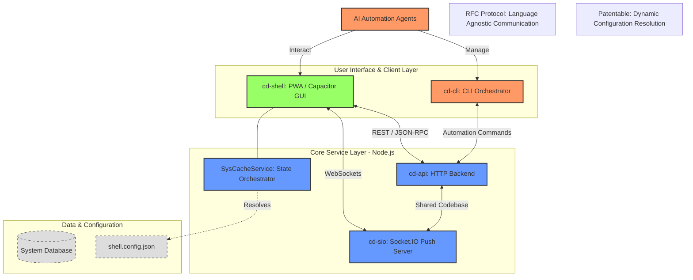
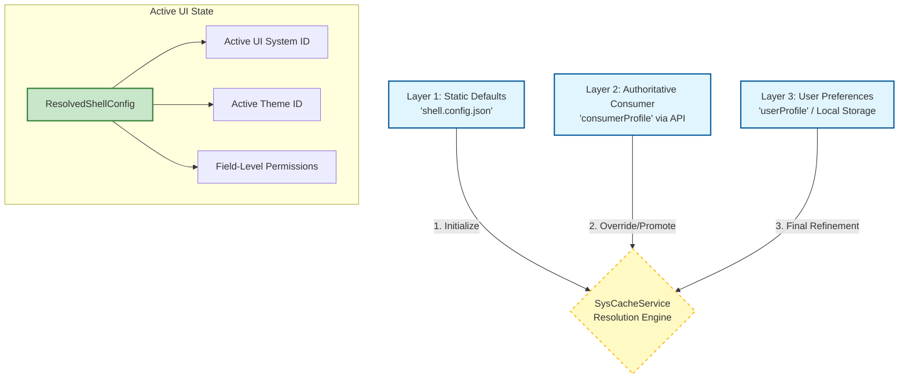
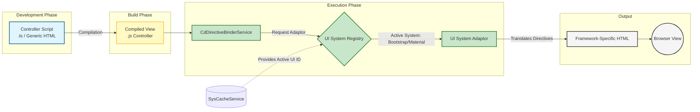
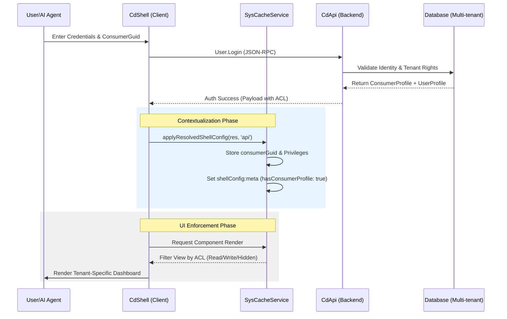
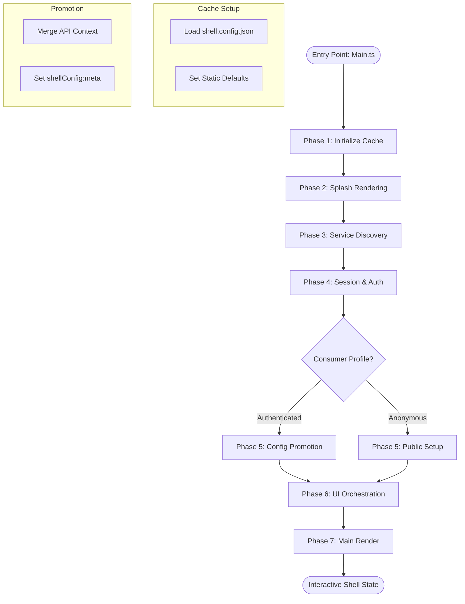
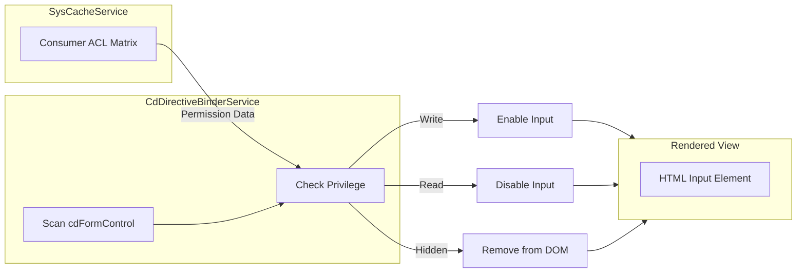

This documentation is structured to meet the requirements of a technical RFC (Request for Comments) and a patent-ready architectural specification. It treats the **CdShell** not just as a UI library, but as a **Language-Agnostic UI Orchestration Protocol**.

---

### Table of Contents

1. **System Architecture & Directory Paradigm** (The "Core-App" Split)
2. **State Management & Configuration Hierarchy** (The `SysCacheService` Protocol)
3. **Authentication & Consumer Contextualization** (Multi-tenant ACL & Profiles)
4. **Generic HTML Scripting & Directive Binding** (The "Template" Abstraction)
5. **UI Adaptor Mechanism & Theme Translation** (System-Agnostic Rendering)
6. **The Bootstrapping Lifecycle** (From Main.run to Final Render)
7. **Data Security & Privilege-Based Field Permissions** (Granular UI Control)

---

### 1. System Architecture & Directory Paradigm

To qualify for industrial replication and patenting, the system enforces a strict separation between the framework's internal logic and the user’s application logic.

* **The `sys` vs. `app` Dichotomy**: All modules are divided into `sys` (system-owned, core protocols) and `app` (developer-owned, feature-specific).
* **The Quad-Folder Module Pattern**: Every module within the shell must strictly adhere to four primary directories:
* **Controllers**: Logic handlers (e.g., `sign-in.controller.ts`).
* **Models**: Data contracts and interfaces.
* **Services**: Reusable business logic and API communicators.
* **Views**: The presentation layer, containing both the template and the compiled JavaScript for the UI adaptor.


---

### 2. State Management & Configuration Hierarchy

The **SysCacheService** acts as the authoritative state manager. It resolves the "Active UI Configuration" by merging multiple layers of data. This mechanism is critical for patenting as it defines a specific method for **Dynamic Interface Resolution**.

#### The Layered Configuration Protocol:

1. **Static Layer (`shell.config.json`)**: Hardcoded defaults (e.g., fallback theme, initial API endpoints).
2. **Authoritative Consumer Layer**: Fetched upon login. This defines the tenant's brand, allowed UI systems, and global restrictions.
3. **User Preference Layer**: The most granular layer, allowing individual users to select preferences (like Dark Mode) within the boundaries set by the Consumer Layer.

#### Implementation Logic:

The `SysCacheService` uses a `set` and `get` mechanism with a `source` parameter to track which layer provided the data. This allows the system to audit and prioritize configuration data in real-time.

```typescript
// sys-cache-refs.md implementation snippet
public applyResolvedShellConfig(resolvedShellConfig: any, source: string): void {
    const uiConfig = resolvedShellConfig.uiConfig || {};
    this.set("shellConfig", resolvedShellConfig, source);
    this.set("uiConfig", uiConfig, source);
    this.set("shellConfig:meta", { hasConsumerProfile: true, appliedAt: Date.now() }, source);
}

```

---

### 3. Authentication & Consumer Contextualization

In CdShell, authentication is not just about identity; it is about **Contextual Initialization**.

* **The Login Response**: When a user logs in via the `User.Login` action, the system receives a payload containing `consumerProfile` and `userProfile`.
* **Contextual Binding**: The `SysCacheService` maps the `consumerGuid` to the current session. This ensures that every subsequent UI render request is filtered through the specific rules (ACL) of that consumer (tenant).
* **Role-Based UI Rendering**: The UI is not static; it is built based on the privileges returned in this session. If a user lacks a "Role," certain components are never even initialized in the DOM.

---

### 4. Generic HTML Scripting & Directive Binding

This is the "Template" abstraction layer. CdShell uses a syntax that allows developers to define UI intent without being tied to a specific framework (like Bootstrap or Material).

* **Directive-Based Architecture**: Much like Angular, CdShell uses attributes like `cdFormControl` or `cdButton`.
* **The Binder Service**: The `CdDirectiveBinderService` maps the logic in the Controller (the "State") to the elements in the Template (the "View").
* **Patentable Aspect**: The ability to decouple the *intent* of a UI component from its *implementation* allows the same generic script to be rendered in a web browser, a mobile app (Capacitor), or even a desktop environment without changing the source code.

---

### 5. UI Adaptor Mechanism & Theme Translation

The **UI Adaptor** is the engine that converts Generic Scripting into specific HTML/CSS structures.

* **Adaptor Discovery**: During bootstrap, the `UiSystemAdapterDiscoveryService` scans the environment for available adaptors (e.g., `CdBootstrapAdapter`, `CdMaterialAdapter`).
* **Theme Resolution**: The system uses `resolveTheme(themeId)`. If a theme is changed, the `SysCacheService` emits a change event, and the UI Adaptor re-processes the view scripts to apply new CSS variables or layout structures without refreshing the page.
* **The Pipeline**:
1. **Input**: Generic Script (`cdButton`).
2. **Processor**: Active UI Adaptor (e.g., Bootstrap).
3. **Output**: `<button class="btn btn-primary">`.


---

### 6. The Bootstrapping Lifecycle

The lifecycle follows a strict sequence in `main.ts` to ensure the UI is never in an inconsistent state:

1. **Initialize Cache**: `SysCacheService` loads the static `shell.config.json`.
2. **Splash Render**: The system renders a minimal "Splash" view immediately to improve perceived performance.
3. **Discovery**: UI Adaptors register themselves.
4. **Auth/Promotion**: The system logs in (anonymously or via user credentials), retrieves the `ConsumerProfile`, and "promotes" the configuration to the Authoritative layer.
5. **Main Render**: The `UiSystemLoader` clears the splash and renders the primary application layout (Sidebar, Header, Content Area).

---

### 7. Data Security & Privilege-Based Field Permissions

CdShell introduces a granular security model where permissions are applied at the **Field Level** rather than just the **Page Level**.

* **Read/Write/Hidden**: Within the configuration cache, each field can have a permission status.
* **Enforcement**: The `CdDirectiveBinder` checks these permissions before binding data to the UI. If a field is marked "Read-Only" in the `consumerProfile`, the binder automatically disables the corresponding input field in the generic template, regardless of what the developer wrote in the controller.

---

*This document serves as the foundation for the CdShell technical specification. Each section can be further expanded with specific API schemas and class diagrams as needed.*

To align with RFC standards and patent-ready documentation, diagrams must move beyond simple illustrations and function as **architectural blueprints**. These diagrams serve to prove the "non-obviousness" and technical rigor of the CdShell orchestration.

Here are the crucial diagrams required for the target audience to visualize the system components:

### 1. High-Level System Topology (The "Birds-Eye View")

This diagram illustrates the relationship between the `cd-cli`, `cd-api`, `cd-sio`, and `cd-shell`. It highlights how the Shell acts as the interface layer for the entire Corpdesk ecosystem.

* **Purpose:** To show the decoupling of the PWA/Capacitor front-end from the Node.js backend services.
* **Visual Focus:** Communication protocols (HTTP/WebSocket) and the distribution of the "sys" and "app" core folders.

### 2. Configuration Inheritance & Resolution Flow

Crucial for the `SysCacheService` documentation, this diagram visualizes how three distinct layers of configuration are merged into a single "Authoritative State."

* **Purpose:** To explain the hierarchy: `Static JSON`  `Consumer API Profile`  `User Preferences`.
* **Visual Focus:** The "Merge Logic" and how conflicts are resolved by the `SysCacheService` to produce the `ResolvedShellConfig`.

### 3. The Generic Scripting & UI Adaptor Pipeline

This is the core of the "Patent-Ready" dimension. It shows how a developer's intent is transformed into a framework-specific implementation.

* **Purpose:** To visualize the abstraction of `Generic Template`  `Compiled View JS`  `UI Adaptor (Bootstrap/Material)`  `DOM`.
* **Visual Focus:** The "Translation Engine" (Adaptor) that stays invisible to the application developer.

### 4. Multi-Tenant Authentication & ACL Contextualization

This diagram tracks the lifecycle of a login request and the subsequent "Contextualization" of the UI.

* **Purpose:** To show how the `consumerGuid` filters the available UI modules and permissions.
* **Visual Focus:** The flow from the `User.Login` action to the population of the `consumerProfile` within the `SysCacheService`.

### 5. The Bootstrapping Lifecycle (Main.run)

A sequential flowchart or swimlane diagram showing the startup phases of the application.

* **Purpose:** To document the timing of the Splash screen, the Discovery of UI systems, and the final Promotion of the configuration.
* **Visual Focus:** The chronological order of operations from the entry point (`main.ts`) to the user’s first interaction.

### 6. Field-Level Privilege Matrix

A security-focused diagram illustrating how permissions (Read/Write/Hidden) are enforced at the directive level.

* **Purpose:** To show that security isn't just "Can I see this page?" but "Can I edit this specific input field?"
* **Visual Focus:** The interaction between the `CdDirectiveBinderService` and the `ConsumerProfile` ACL metadata.

### 7. Directory Paradigm (The "Quad-Folder" Module)

A structural diagram representing the internal organization of a single feature module.

* **Purpose:** To enforce the architectural standard for contributing developers.
* **Visual Focus:** The isolation of `Models`, `Controllers`, `Services`, and `Views`.

### 8. The Theme Discovery & Resolution Engine

This diagram illustrates how the `UiSystemAdapterDiscoveryService` scans for available themes and UI systems.

* **Purpose:** To show the extensibility of the framework.
* **Visual Focus:** The registry of "Descriptors" (UI System Descriptors and Theme Descriptors) managed by the system cache.

To align with RFC-level architectural standards and patent-ready documentation, the **High-Level System Topology** must clearly demonstrate the decoupling of orchestrators, backend services, and the PWA shell.

The following Mermaid document defines the structural relationships and communication protocols within the Corpdesk ecosystem.



### Architectural Analysis of Diagram No. 1

**1. The "Dual-Orchestrator" Model:**
The system is managed by two distinct heads: the `cd-cli` for automated/developer workflows and the `cd-shell` for human-centric or PWA interactions. Both interface with the same core backend logic, ensuring consistency across different environments.

**2. Shared Logic Core:**
The `cd-api` and `cd-sio` share a codebase, allowing for seamless transition between synchronous HTTP requests and asynchronous push notifications via Socket.IO. This is a key requirement for real-time AI-agent management.

**3. State Authority:**
The `SysCacheService` is positioned as the heart of the Shell. It is not merely a storage unit but a "State Orchestrator" that resolves external configurations (from the API) and local overrides (from the config files) to dictate the behavior of the UI.

**4. AI-Agent Integration:**
The topology explicitly positions AI Agents as primary actors. By providing both a CLI and a configurable Shell, the system allows agents to operate at the command level while providing a visual "window" for human oversight.

This Mermaid diagram illustrates the **Layered Configuration Resolution Protocol**. It details the process of merging disparate data sources into a single, authoritative state within the `SysCacheService`, which is a key technical claim for the system's patent-ready architecture.



### Technical Specification of the Flow

**1. The Static Initialization (Bootstrap Phase):**
Upon application launch, the `SysCacheService` performs a synchronous load of the `shell.config.json`. This ensures the system has "survival" data (e.g., fallback API URLs and default splash themes) before any network requests are made.

**2. The Promotion Mechanism (Auth Phase):**
Once the user logs in, the `User.Login` action returns the `consumerProfile`. As specified in the `sys-cache-refs.md`, the system calls `applyResolvedShellConfig(resolvedShellConfig, source)`. This "promotes" the configuration from a generic state to a tenant-specific state. The `source` parameter (e.g., `"api"`) is cached alongside the data to maintain a lineage of where the configuration originated.

**3. Field-Level Resolution:**
The resolution is not just a shallow object merge. It follows a specific priority:

* **Brand Identity:** Forced by the Consumer Layer (e.g., Company Logo).
* **Functional Access:** Controlled by the Consumer Layer via ACL (e.g., "Feature X is disabled for this tenant").
* **Personalization:** Resolved at the User Layer (e.g., "User prefers Dark Mode over the Consumer's Default Light Mode").

**4. The Metadata Flag:**
As seen in the source code, once the flow is complete, the system sets a `shellConfig:meta` flag with `hasConsumerProfile: true` and a timestamp `appliedAt`. This flag serves as a gatekeeper for the `CdShell` rendering engine, ensuring no protected UI components are rendered until the resolution flow has reached the "Authoritative" stage.

This diagram represents the **Generic Scripting and UI Adaptor Pipeline**, which is the core mechanism for achieving framework-agnostic UI rendering. This process is a primary candidate for patenting because it decouples the **Intent** (Developer's Script) from the **Implementation** (Framework-specific HTML).



### Technical Breakdown of the Pipeline

**1. The Source Abstraction (Development):**
The developer writes logic using `CdFormControl` and `cdButton` within a TypeScript controller. This is a **Generic Intent**. The developer does not care if the final button is a Bootstrap `btn-primary` or a Material `mat-raised-button`.

**2. The Directive Binder (The "Glue"):**
The `CdDirectiveBinderService` acts as the bridge. It scans the `__template()` of the compiled JavaScript and identifies **Directives**. Instead of rendering them directly, it queries the `SysCacheService` to determine which UI System is currently active.

**3. The UI Adaptor (The "Translator"):**
The **UI Adaptor** is the most critical component for the RFC standard. It is a language-agnostic protocol that defines how a generic element (e.g., a "Date Picker") should be transformed into a specific HTML structure.

* If the Active UI is **Bootstrap**, the adaptor wraps the input in a `div.form-group`.
* If the Active UI is **Material**, it wraps it in a `mat-form-field`.

**4. Dynamic Swapping:**
Because the Binder and Adaptor work at runtime, the system can swap the entire UI framework (e.g., switching from a legacy Bootstrap 4 layout to a modern Tailwind layout) without the developer ever touching the original `.ts` controller or the `__template`.

---

**Would you like me to proceed with the Mermaid diagram for No. 4 (Multi-tenant Authentication & ACL Contextualization)?**

This diagram illustrates the **Multi-Tenant Authentication & ACL Contextualization** process. This mechanism is vital for patenting as it defines a method for **Dynamic Interface Authorization**, where the UI is not just "gated" by a login, but reconstructed based on a granular permission matrix returned in the session payload.



### Technical Significance for RFC & Patenting

**1. The "Consumer Context" Anchor:**
Unlike standard auth which only identifies the *User*, this protocol requires a `consumerGuid` at the point of entry. This anchor allows the `SysCacheService` to fetch a **Tenant Schema** that dictates the visual identity and functional boundaries of the shell before the first page is even rendered.

**2. ACL-Driven Component Visibility:**
The `consumerProfile` contains a complex mapping of module privileges. In the **CdShell** protocol:

* **Hidden**: The component logic is never initialized, and the DOM element is omitted.
* **Read-Only**: The `CdDirectiveBinderService` automatically sets the `disabled` attribute on all generic controls (inputs, buttons) within that module's view.
* **Write**: Full interaction enabled.

**3. Session-Based Configuration Promotion:**
A key patentable claim is the **Promotion of State**. The system starts with a "Public State" (minimal config) and, upon successful authentication, "promotes" the `SysCacheService` to an "Authoritative State." This transition is tracked via the `shellConfig:meta` metadata, ensuring that sensitive UI adaptors do not trigger until the `appliedAt` timestamp is verified.

**4. Data Lineage Tracking:**
By passing the `source` parameter (e.g., `'api'`) to the cache, the system maintains a lineage. If a user attempts to manually override a setting in the console, the system can detect that the "local" source has a lower priority than the "api" source, maintaining the integrity of the tenant's security policies.

---

**Would you like to move to Diagram No. 5 (The Bootstrapping Lifecycle)?**

### 5. The Bootstrapping Lifecycle (Main.run)

The **Bootstrapping Lifecycle** is the rigorous sequence of operations that transitions the CdShell from a raw, uninitialized state to a fully rendered, secure environment. In a patent-ready context, this represents a **Deterministic Initialization Protocol**, ensuring that no protected UI components are rendered until the configuration is "promoted" to an authoritative state.



#### Technical Lifecycle Stages:

1. **Phase 1 & 2: Instant Visibility**: The system immediately loads `shell.config.json` and renders a splash screen. This ensures a high-performance "First Meaningful Paint" while the heavier logic remains pending.
2. **Phase 3: Discovery**: `UiSystemAdapterDiscoveryService` inventories available UI systems (e.g., Bootstrap, Material) and themes. This registry is stored in the `SysCacheService` for the Binder to reference later.
3. **Phase 4 & 5: The "Promotion" Gate**: This is the most critical security step. The system attempts to resolve a user session. If a `consumerProfile` is retrieved, the `SysCacheService` runs `applyResolvedShellConfig()`. This sets the `hasConsumerProfile: true` flag, which acts as the "go-ahead" for rendering tenant-specific modules.
4. **Phase 6: UI Orchestration**: The `UiSystemLoader` identifies the target UI System (e.g., Bootstrap) and initializes the corresponding Adaptor pipeline.
5. **Phase 7: Main Render**: The shell finally builds the core navigation, sidebars, and the default home controller.

---

### 6. Data Security & Privilege-Based Field Permissions

This diagram visualizes the **Granular Field-Level Authorization** mechanism. This is a unique claim for the system's RFC dimension, as it moves beyond simple "Page Access" to "Input-Level Control" based on the Consumer Context.



#### Why this is Patent-Ready:

* **Decoupled Logic**: The developer writes a standard input in the generic script. They do not write "if-else" statements for security.
* **Enforcement at the Core**: The `CdDirectiveBinderService` intercepts the rendering process. It cross-references the `cdFormControl` name against the `consumerProfile` stored in the cache.
* **Multi-Tenant Isolation**: Two different users can view the exact same generic script, but one may see a disabled field (Read-Only) while the other sees an editable one (Write), based entirely on the `consumerGuid` provided during the **Contextualization Phase**.

---

**Would you like me to conclude with Diagram No. 7 (Directory Paradigm) and the final summary?**