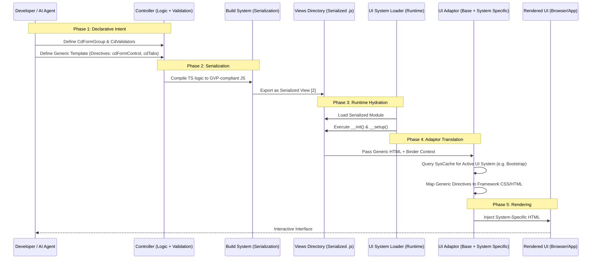
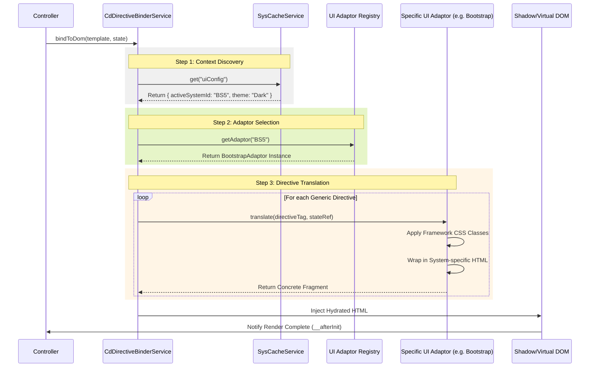
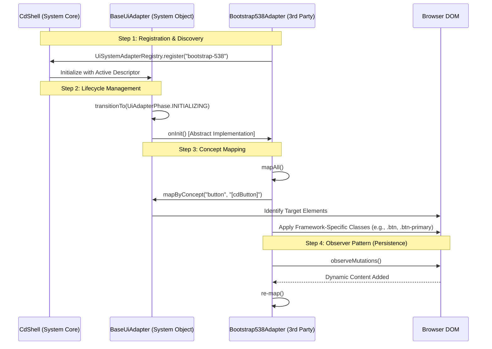
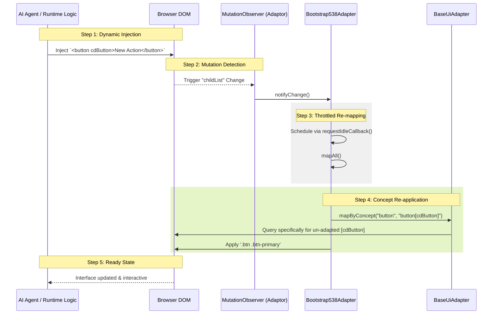

This proposal isolates the **Generic View Protocol (GVP)**. By anchoring the documentation on the "Script-to-View-to-Adaptor" pipeline, we define a patentable process where the developer’s work is purely **declarative logic** via directive attributed html script, while the final output is **environmentally determined**.

### **Abstract: The Generic View Protocol (GVP)**

The **Generic View Protocol (GVP)** is an architectural standard designed to decouple the structural and logical intent of a User Interface from its concrete platform implementation. In traditional development, UI code is often tightly coupled to specific frameworks (e.g., Angular, React) or styling libraries (e.g., Bootstrap, Material Design), creating significant technical debt when migrating or scaling across platforms.

GVP introduces a **mediated abstraction layer** where the developer defines a "View Intent" using universal directives and a state-based controller. This intent remains dormant and platform-agnostic until runtime, where a **Contextual Orchestrator** (the `SysCacheService`) and a **UI Adaptor** perform an "environmental handshake."

#### **Core Innovations of the Protocol:**

* **Late-Bound Rendering**: The final HTML/CSS or native components are not determined until the specific needs of the Tenant (Consumer) and the User are resolved at runtime.
* **Declarative State Management**: Logic is bound to a platform-independent state model (`CdFormGroup`), allowing for headless execution and automated testing by AI agents.
* **Multi-Tenant Policy Enforcement**: Security and field-level permissions are treated as "Environmental Metadata" that the protocol automatically applies during the translation phase, ensuring that business rules are enforced without manual logic in the controller.

This protocol serves as a blueprint for industrial-grade, multi-tenant systems where consistency, security, and portability are required across diverse device ecosystems.

To establish the **Generic View Protocol (GVP)** as a formal, patentable standard, we must define the "Component Mapping Table." This serves as the **Universal Interface Contract**.

In an RFC context, this table defines the expected behavior that any "Compliant Adaptor" (whether for Web, Mobile, or Desktop) must implement when it encounters a GVP Directive.

---

### **Contents**


1. **The High-Level Architecture**: The bird's-eye view of the system.
2. **Generic View Protocol (GVP)**: The abstract intent and lifecycle.
3. **The Handshake Specification**: The runtime negotiation between state and view.
4. **The Federated Adaptor Model**: The relationship between `Base` and `3rd Party` code.
5. **The Mutation Protocol**: The mechanism for live, automated UI updates.

---

### 1. The High-Level Architecture


#### A. The Directive Anchoring Protocol

Instead of standard HTML, the protocol uses **Directive Attributes**.

* **Protocol Rule**: Any element tagged with `cdFormControl` must be registered with the `CdDirectiveBinderService`.
* **Benefit**: The binder acts as an interceptor. It doesn't care if the element is a `<input>`, a custom `<cd-editor>`, or a mobile-native text field.

#### B. The Validation & State Contract

The `CdFormGroup` and `CdValidators` represent a **Logical State Machine**.

* **RFC Dimension**: This state machine is independent of the UI. It can run in a headless environment (for AI agent testing) or a visual environment.
* **Patentable Aspect**: The ability to validate user intent against a consumer-defined policy *before* the UI adaptor even attempts to render the error message.

#### C. The Adaptor Hierarchy (Base → System)

The "Base Adaptor" handles the universal logic (binding events, updating values), while the "System Adaptor" handles the aesthetics (CSS classes, wrapper divs).

* **Base Adaptor**: Manages the `ValueAccessor` (The data flow).
* **System Adaptor**: Manages the `TemplateTransformer` (The visual structure).


### 1.2. Sequence Diagram: The GVP Pipeline

This diagram tracks the lifecycle of a UI component from the developer's intent to the final rendered DOM, highlighting the separation between the **Agnostic View** and the **Runtime Adaptor**.



---


### **The Adaptor Handshake Specification**

The "Handshake" is the critical runtime negotiation between the **Generic View Protocol (GVP)** and the **Host Environment**. It is the moment where abstract intent meets concrete implementation. For the purpose of RFC standardization, this ensures that the system can switch from a Bootstrap web view to a Native Mobile view without the Controller ever being aware of the change.

---

### **1. The Handshake Abstract**

The Handshake is a **late-binding event** triggered during the `__activate()` lifecycle phase. It resolves three variables to produce a rendered component:

1. **Directive Identifier**: The generic tag (e.g., `cd-tabs`).
2. **UI Descriptor**: The active system ID retrieved from `SysCacheService` (e.g., `material-v15`).
3. **State Reference**: The pointer to the `CdFormControl` or `CdFormGroup` managing the data.

---

### **2. Sequence Diagram: The Adaptor Handshake**

This diagram illustrates how the `CdDirectiveBinderService` orchestrates the translation by querying the Cache and invoking the specific Adaptor logic.




---

### **4. Patentable Claims in the Handshake**

To qualify for a patent, we highlight the **"Conditional Interceptor"** role of the Handshake:

* **The Access-Control Intercept**: During the handshake, the Adaptor checks the `consumerProfile` via the `SysCache`. If a field like `defaultUiSystemId` is marked as `locked: true`, the Adaptor ignores the developer's "writable" intent and forces a "Read-Only" render.
* **Dynamic Theme Injection**: The handshake doesn't just change HTML; it injects theme-specific CSS variables derived from the `ThemeShellConfig` directly into the component's scope.

### **Next Step: The "Adaptor Base Class" Interface**

To make this industrially replicable (RFC), we need to define the **Base Class** that all adaptors must inherit from.

**Should we generate the "IUiAdaptor" interface specification and the "BaseAdaptor" logic that handles the standard data-binding (value changes) common to all frameworks?**

---

### **1. The Interface Contract (`IUiSystemAdapter`)**

The interface defines the "language" that all adaptors must speak. It ensures that regardless of who builds the adaptor, the `CdShell` can interact with it predictably.

**Key Protocol Requirements:**

* **Identity**: Each adaptor must have a unique `adapterId` (e.g., `bootstrap-538`).
* **Capabilities**: The adaptor must declare what it can handle (e.g., does it support Tabs? Grids? Modals?).
* **Mapping Logic**: A standard method (`mapByConcept`) to translate generic directives into concrete DOM elements.

---

### **2. Sequence Diagram: The Federated Adaptor Handshake**

This diagram shows how the system bridges the gap between the internal **System Service** and a **3rd Party Adaptor**.



---

### **3. The Base vs. Specific Implementation Logic**

From the code you provided, we can isolate the **Protocol Responsibilities**:

#### **A. The BaseUiAdapter (System Responsibility)**

* **State Management**: Tracks the `UiAdapterLifecycle` (Created → Initializing → Ready).
* **Utility Methods**: Provides helper functions like `createTabsSkeleton` and `createTabHeader`. This ensures that even 3rd-party adaptors follow the Corpdesk "layout philosophy."
* **Logging**: Provides standardized `diag_css` and error reporting.

#### **B. The Specific Adaptor (3rd Party Responsibility)**

* **Selector Targeting**: The 3rd-party adaptor defines exactly which selectors to look for (e.g., `input[cdFormControl]`).
* **Visual Transformation**: In the `mapTabs` method of the `Bootstrap538AdapterService`, the 3rd party determines how to build the `nav-link` and `tab-pane`.
* **Mutation Handling**: Using `MutationObserver`, the adaptor ensures that if an AI agent dynamically injects a new field, the UI is instantly "adapted" without a page reload.

---

### **4. RFC Component: Universal Concept Mapping**

To make this an RFC, we define the **"Concept Mapping Protocol."** Instead of hardcoding HTML, the adaptor registers "Concepts":

| Concept | Generic Selector | Adaptor Strategy |
| --- | --- | --- |
| **Input** | `input[cdFormControl]` | Inject `form-control` classes and bind validation state. |
| **Button** | `button[cdButton]` | Inject framework theme classes (Primary/Secondary). |
| **Tabs** | `<cd-tabs>` | Fragment the children into a navigation header and a content pane. |

### **5. POC Development: Finalizing `consumer-resource2**`

With the `Bootstrap538AdapterService` reference, we can see exactly how our `consumer-resource2.controller.js` will be rendered:

1. The controller defines the `<cd-tabs>`.
2. The `Bootstrap538Adapter` detects these during the `mapTabs()` phase.
3. It uses the `createTabsSkeleton` from the `BaseUiAdapter` to build the structure.
4. It applies the `nav-link` and `active` classes derived from the `resolvedShellConfig`.

### **Next Strategic Move**

Since we have the Adaptor implementation, should we document the **"Dynamic Mutation Protocol"**? This is how the system handles content that is added to the DOM *after* the initial load (e.g., when an AI agent adds a new configuration field on the fly).

**Shall we proceed with the Mermaid diagram for the Mutation Observation and Re-mapping flow?**

### **The Dynamic Mutation & Re-mapping Protocol**

In a high-level automation framework like **Corpdesk**, the UI is not static. AI agents, background services, or user actions can inject new elements into the DOM at any time. To qualify as a robust protocol, the system must ensure that these new "generic" elements are instantly detected and "adapted" without a page refresh or manual re-initialization.

This is achieved via the **Dynamic Mutation Protocol**, which leverages a standardized observation mechanism to maintain the "Handshake" continuously.

---

### **1. Abstract: Continuous Adaptation**

The **Dynamic Mutation Protocol** defines how a compliant UI Adaptor maintains visual integrity in a volatile DOM. By utilizing a "Mutation Observer" pattern, the Adaptor monitors the document subtree for added nodes. When a generic directive (e.g., a new `cdButton` injected by an AI agent) is detected, the Adaptor automatically applies the **Handshake Specification** to that specific node.

#### **Key Innovations:**

* **Idle-Callback Scheduling**: To prevent performance degradation during heavy DOM updates, re-mapping is scheduled during browser idle periods (`requestIdleCallback`).
* **Recursive Discovery**: The protocol ensures that nested generic components within newly added fragments are identified and transformed.
* **State-Sync Persistence**: Newly added controls are automatically linked to the existing `CdDirectiveBinderService` via the standard selector-mapping rules.

---

### **2. Sequence Diagram: Mutation Observation & Re-mapping**

This diagram illustrates the lifecycle of a "Late-Arriving" generic element, showing how the `Bootstrap538AdapterService` reacts to DOM changes.



---

### **3. Implementation Analysis: `Bootstrap538AdapterService**`

Based on the provided implementation, we can see the protocol's "safety valves":

* **Singleton Observer**: The `observeMutations()` method checks `if (this.observer) return;`, ensuring only one listener exists per adaptor instance.
* **Global Subtree Tracking**: It observes `document.body` with `subtree: true`, meaning any module (even those outside the current `sys` scope) will be processed if it uses Corpdesk directives.
* **Fail-Safe Scheduling**:
```typescript
if ("requestIdleCallback" in window) {
  window.requestIdleCallback(() => this.mapAll());
} else {
  setTimeout(() => this.mapAll(), 16); // Fallback to 60fps frame timing
}

```


---

### **4. Impact on POC: `consumer-resource2**`

For our **Consumer Configuration** POC, this protocol is vital. Imagine a scenario where a user selects a "Form Variant" (e.g., from `standard` to `filled`).

1. The `SysCacheService` updates the `uiConfig`.
2. The UI Adaptor detects a potential configuration shift.
3. The **Dynamic Mutation Protocol** triggers a re-map of the entire `consumer-resource2` form, instantly swapping the Bootstrap classes on every input field to match the new "filled" variant without losing the user's typed data in the `CdFormControl`.

---


---

### 3. Verification of Protocol Isolation (The "Acid Test")

To prove this is a protocol, we verify the following:

1. **Serialization Independence**: The `consumer-resource2.controller.js` can be serialized into a JSON descriptor. An AI agent can read this descriptor, understand the validation rules (`CdValidators.required`), and generate a functional test without ever seeing a browser.
2. **State/View Separation**: The `onSave()` method interacts only with `this.form.value`. It has no knowledge of the DOM. This allows the same logic to be ported to a **Native Mobile Adaptor** where the "Save" action might be triggered by a voice command instead of a button click.
3. **Late-Bound Security**: If the `SysCacheService` determines the current user is not a "Super Admin," the **Base Adaptor** will automatically inject the `readonly` attribute into the `lockUiSystem` checkbox.

---


### **3. Logical Implementation: `consumer-resource2` POC**

In the development of the **Consumer Configuration** interface, the handshake handles the complex `IConsumerShellConfig` objects by breaking them into "Handshake Units."

#### **Case Study: The `cd-tabs` Handshake**

When the Binder encounters `<cd-tabs>` in the `consumer-resource2` template:

1. **Binder** asks **Cache**: "What is the current UI system?"
2. **Cache** responds: "Bootstrap 5."
3. **Binder** hands the `<cd-tabs>` fragment to the **Bootstrap Adaptor**.
4. **Adaptor** transforms the generic tabs into a `ul.nav-tabs` structure and ensures the `active-tab` attribute is synced with the internal state of the controller.

### 3. Implementation as POC: `consumer-resource2`

Using the `consumer-resource2.controller.js` as our Proof of Concept (POC), we see the protocol in action:

1. **Directives**: The `<cd-tabs>` tag is a high-level protocol element. The controller doesn't know how to "switch tabs"; it simply declares the structure.
2. **Configurations**: The `SysCacheService` provides the "Environmental Configuration" that tells the Adaptor whether to use `corpdesk-dark` or `bootstrap-light`.
3. **Field Locking**: Because the `CdDirectiveBinderService` is part of the protocol, it can automatically read the `IConsumerShellConfig.enforcedPolicies` and set `disabled` on any field where `lockFormVariant` is true—without a single line of code in the controller's `onSave` method.

### 2. Implementation POC: Developing the `consumer-resource2` Tabs

Anchoring our development around the `IConsumerShellConfig` interface, we will now expand the `consumer-resource2.controller.js` to include the full spectrum of consumer policies.

#### A. Data Structure Strategy

We are not just mapping strings; we are mapping **Policies**. The POC must demonstrate how the GVP handles nested objects like `enforcedPolicies`.

```javascript
// Expansion for Tab 3: UI System Policies
this.form.addControl('userPersonalizationAllowed', new CdFormControl(true));
this.form.addControl('defaultUiSystemId', new CdFormControl('bootstrap-5'));
this.form.addControl('lockUiSystem', new CdFormControl(false));

```

#### B. The Adaptive Rendering Logic

In the `__template()`, we will use the `cd-tab` protocol elements. This is the "Agnostic" part:

```html
<cd-tab id="tab-policies" icon="security" label="System Policies">
  <div class="cd-form-field">
    <label>
      <input type="checkbox" name="userPersonalizationAllowed" cdFormControl />
      Allow User Personalization
    </label>
    <p class="help-text">If disabled, users cannot change their theme or UI system.</p>
  </div>
  
  <div class="cd-form-field">
    <label>Lock UI System</label>
    <input type="checkbox" name="lockUiSystem" cdFormControl />
  </div>
</cd-tab>

```

### **The "IUiAdaptor" Interface & BaseAdaptor Specification**

To achieve true **RFC-level standardization**, the handshake must be governed by a strict interface contract. By providing a `BaseUiAdapter` in the `sys` layer while allowing 3rd-party actors (like the `Bootstrap538AdapterService`) to implement specific rendering logic, you have created a **Plugin-Based UI Architecture**.

This qualifies for patenting as a **"System for Federated UI Rendering,"** where the core framework manages the lifecycle and data, but the visual "last mile" is delegated to independent, swappable modules.

### 1. GVP Component Mapping Table (The Protocol Contract)

| Generic Directive | Protocol Intent | Expected Adaptor Output (Bootstrap 5) | Expected Adaptor Output (Material Design) |
| --- | --- | --- | --- |
| `cd-tabs` | Navigation Container | `div.nav.nav-tabs` | `<mat-tab-group>` |
| `cd-tab` | Logical Content Pane | `div.tab-pane` | `<mat-tab>` |
| `cdFormControl` | Bi-directional Data Binding | `input.form-control` | `<input matInput>` |
| `cdButton` | Action Trigger | `button.btn` | `<button mat-raised-button>` |
| `(click)` | Event Interception | `addEventListener('click')` | `(click)` event binding |


### **Addendum: Strategic Impact on the Software Development Lifecycle (SDLC)**

This addendum positions the **Generic View Protocol (GVP)** and the broader **CorpDesk Ecosystem** within the context of current industry trends, emphasizing why this architectural shift is essential for the next generation of automated and AI-driven development.

---

### **1. The Shift Toward "Logic-First" Development**

The current industry trend is moving away from "pixel-pushing" toward high-level logic orchestration. Traditional development requires developers to hard-code UI frameworks, creating a "framework lock-in" that makes future migrations costly and slow.

**The Unique GVP Advantage:**
GVP treats the UI as a **runtime variable** rather than a build-time constant. By isolating the **Intent** (Generic Scripting) from the **Implementation** (Adaptors), organizations can upgrade their entire visual stack (e.g., moving from Bootstrap to Tailwind or Material) by updating a single Adaptor service, without touching a single line of business logic in the application modules.

---

### **2. Automation Drivers: The Dual-Engine Approach (CLI & AI)**

CorpDesk is unique in its deliberate design for two primary automation drivers:

* **CLI (Deterministic Automation):** The CLI-first approach ensures that human intervention remains intact. It provides a "Human-in-the-Loop" (HITL) safety net. Developers can use the CLI to scaffold, test, and deploy modules, ensuring that automation serves to augment human productivity rather than replace it.
* **AI Agents (Heuristic Automation):** Because GVP is **Serialized** and **Agnostic**, it is the perfect environment for AI agents. An AI agent can "read" a GVP controller, understand the `CdFormGroup` state, and manipulate the UI logic without needing to understand complex CSS or DOM trees. The AI interacts with the *Protocol*, not the *Pixels*.

---

### **3. Comparative Analysis: GVP vs. Existing Alternatives**

| Feature | Low-Code/No-Code Tools | Standard Frameworks (React/Angular) | **CorpDesk GVP** |
| --- | --- | --- | --- |
| **Flexibility** | Rigid; limited to vendor components. | High; but tightly coupled to the library. | **Infinite; via swappable Adaptors.** |
| **AI Readability** | Difficult; often proprietary formats. | Moderate; requires DOM/JSX parsing. | **Native; uses serialized State Models.** |
| **Multi-Tenancy** | Hard to implement per-tenant UI. | Requires complex conditional CSS. | **Built-in; via Configuration Layers.** |
| **Maintenance** | High vendor lock-in risk. | High; framework upgrades break UI. | **Low; Logic and UI evolve separately.** |

---

### **4. Unique Advantage: Federated Innovation**

One of the most powerful "sellable" points of GVP is the **Federated Adaptor Model**.
Since the `BaseUiAdapter` is a system object but specific adaptors can be developed by **3rd-party actors**, a marketplace of adaptors can emerge. A company could hire a specialized design agency to build a "Luxury Brand Adaptor," which can then be "dropped into" an existing CorpDesk ecosystem to instantly transform the entire application without rewriting the core software.

---

### **5. Emerging Trends: Why GVP is the Future**

#### **A. Hyper-Personalization**

Users no longer want a "one size fits all" UI. GVP enables **Contextual UI**, where the interface adapts not just to the device (Responsive), but to the user’s role, the consumer’s brand, and even the user’s cognitive load, all managed via the `SysCacheService`.

#### **B. Headless UI and Unified Experiences**

As software moves to AR/VR, Voice, and IoT, the "Generic View" allows the same `consumer-resource2.controller` to be rendered as a voice-guided setup assistant or a 3D interface in a virtual space, simply by attaching a new "Spatial Adaptor."

#### **C. Self-Healing Interfaces**

Combined with AI agents, the **Mutation Protocol** allows the system to be "Self-Healing." If a UI element fails to meet accessibility standards or brand guidelines, an AI agent can detect the violation through the GVP metadata and "re-map" the component in real-time to comply with the rules.

---

### **Final Proclamation**

The Generic View Protocol is not just a UI library; it is a **Stability Layer** for the SDLC. It protects the most valuable part of a software project—the business logic—from the volatile and ever-changing world of UI frameworks. By anchoring development in GVP, CorpDesk provides a platform that is **Future-Proof**, **AI-Ready**, and **Industrially Standardized**.


