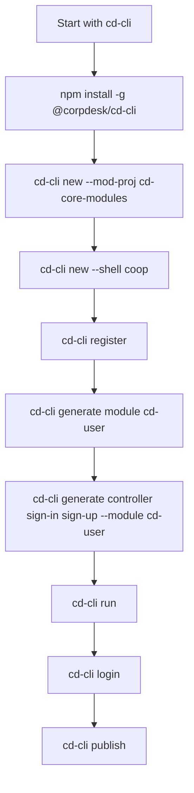

# Module Developer Workflow using `cd-cli`

This document outlines the standard workflow for third-party developers to create and publish a Corpdesk module (also called a `cd-app`) that is compatible with the `cd-shell` platform.

## Prerequisites

Before getting started, ensure you have:

* Node.js ≥ 16 installed
* npm installed
* Capacitor environment set up (if testing on mobile)
* Access to the Corpdesk registry (via [register](#register-module) step)

---

## Installation

Install the Corpdesk CLI globally:

```bash
npm install -g @corpdesk/cd-cli@latest
```

---

## Project Initialization Workflow

This section describes how to set up your dev environment and begin module development.

### 1. Create a Corpdesk Module Project

A **module project** is a container that can host one or more Corpdesk modules.

```bash
cd-cli new --mod-proj cd-core-modules
```

This initializes a new PWA module development workspace named `cd-core-modules`.

---

### 2. Set Up Shell Environment

To scaffold a runnable dev shell environment:

```bash
cd-cli new --shell coop
```

This installs a local dev environment with default core modules such as:

* `cd-user`
* `cd-moduleman`
* `cd-comm`

---

### 3. Register with Corpdesk Platform

Before publishing your modules, register your dev identity:

```bash
cd-cli register
```

This launches a wizard that can register your identity either via:

* CLI interface
* Web interface (coming soon)

---

### 4. Generate a Module

Generate a module within your workspace:

```bash
cd-cli generate module cd-user
```

This scaffolds a new module named `cd-user` with the appropriate structure.

---

### 5. Add Controllers

Controllers define functionality and actions within your module.

```bash
cd-cli generate controller sign-in sign-up --module cd-user
```

You can create multiple controllers per module.

---

### 6. Run and Test Locally

To test the module using the development shell (powered by Vite):

```bash
cd-cli run
```

This launches a hot-reload development server for rapid prototyping.

---

### 7. Login to Corpdesk Platform

Before publishing, authenticate with your Corpdesk account:

```bash
cd-cli login
```

---

### 8. Publish to Registry

To publish your module to the central `cd-registry` for others to use:

```bash
cd-cli publish
```

This uploads your module, metadata, and build configuration to the Corpdesk registry.

---

## Summary Workflow



---

## What's Next?

Once the module is published:

* It becomes installable on any `cd-shell` system.
* It inherits theming and menu integration automatically.
* It can run on Capacitor-enabled apps (PWA, Android, iOS).
* It can use features like:

  * `__template()` to render content
  * `__processFormData()` for data processing
  * Dynamic theming via `theme.json`
  * Customizable UI with sub-themes
